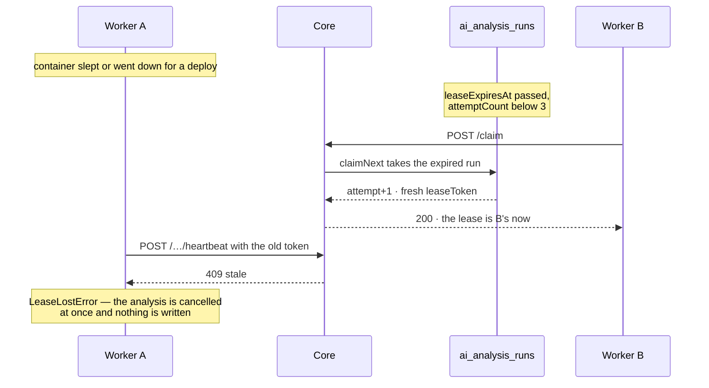
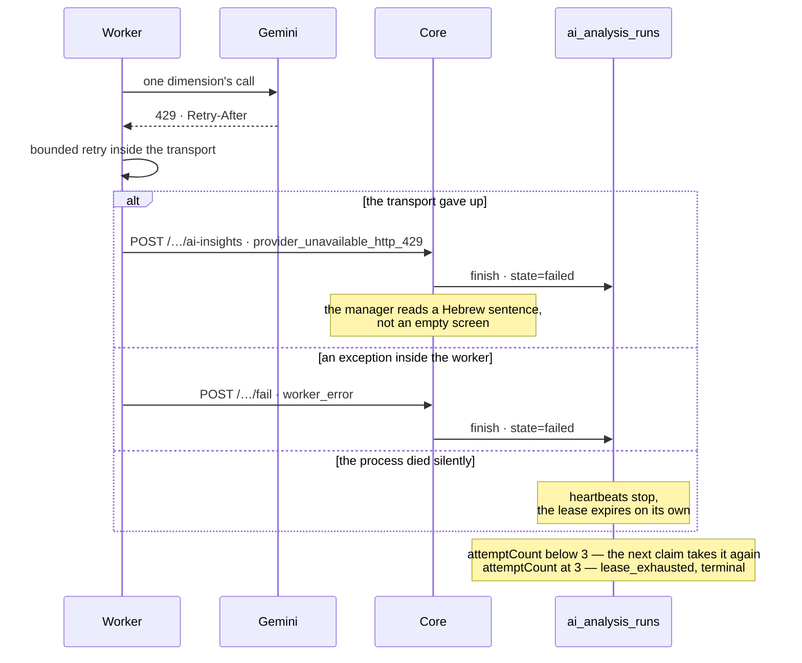
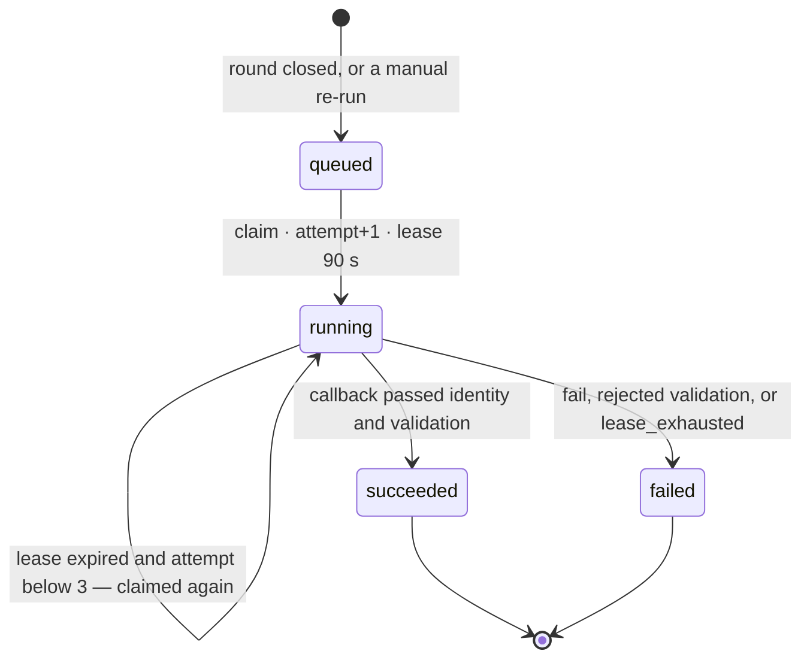
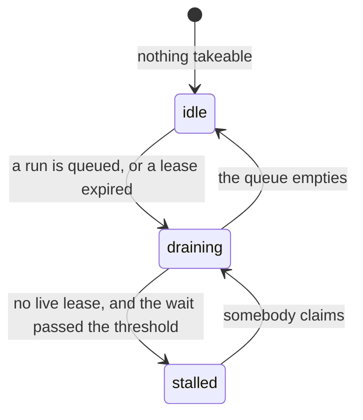

# The life of one AI analysis run

Living document. Implementation-level companion to
[`platform-handbook.md`](platform-handbook.md) §7, which tells the same story
without endpoint names: read that one first if the question is *why* the queue
exists, and this one if the question is what exactly goes over the wire.

The behaviour drawn here is owned by ADR-006, ADR-016 and ADR-017 in
[`../PROJECT_CONTEXT.md`](../PROJECT_CONTEXT.md); cross-service architecture is
in [`ai-analytics-handoff.md`](ai-analytics-handoff.md). Where a diagram and the
code disagree, the code is right and this file is what gets fixed.

## The shape

Two runtimes, one database, and the database belongs to Core alone. The Python
service holds no persistence: it reads aggregates through the MCP endpoint and
changes a run's state only through Core's HTTP endpoints.

## The ordinary path

```mermaid
sequenceDiagram
    autonumber
    actor M as Manager
    participant C as Core (Next.js)
    participant DB as ai_analysis_runs
    participant W as AI service (worker)
    participant G as Gemini

    M->>C: PATCH /api/rounds/… — close the round
    Note over M,C: starting the next round closes the previous one too,<br/>and the builder's save and POST /api/rounds<br/>dispatch for it the same way
    C->>C: responseCount against privacyThreshold
    Note over C: below the threshold — below_threshold,<br/>no run is created at all
    C->>DB: INSERT · state=queued · trigger=closure
    Note over DB: requestKey derived from the round's history;<br/>a partial unique index keeps one<br/>active run per round
    DB-->>C: run.id

    loop poll every 2 s, widening to 30 s while empty
        W->>C: POST /api/ai-analysis-runs/claim
        alt queue empty
            C-->>W: 204 No Content
        else a run is eligible
            C->>DB: claimNext — conditional UPDATE
            DB-->>C: state=running · attempt+1 · lease +90 s
            C-->>W: 200 · run and leaseToken
        end
    end

    W->>C: MCP get_round_analytics
    C-->>W: aggregates only, no respondent row

    par heartbeat every 30 s
        W->>C: POST /…/heartbeat · leaseToken
        C->>DB: lease extended by another 90 s
        C-->>W: 200 running
    and the analysis itself
        W->>W: privacy gate, before the first token
        W->>G: roughly 30 calls across 8 dimensions
        G-->>W: Hebrew copy
        W->>W: safety validator · up to 3 repair passes
    end

    W->>C: POST /api/rounds/…/ai-insights + run-id and lease-token headers
    C->>C: identity first, then contract validation
    C->>DB: finish · state=succeeded · result
    C-->>W: 200
    M->>C: GET /api/rounds/…/ai-insights
    C-->>M: the Stone Map
```

The order at step 21 is deliberate. Identity is resolved before the payload is
validated — otherwise a callback aimed at the wrong round could mark a healthy
leased run as failed.

The poll loop at the top is not a metronome. Two seconds is what a worker with
work uses; every `204` doubles the next wait up to the idle ceiling
(`AI_JOB_POLL_MAX_INTERVAL_SECONDS`), and the first claim snaps it back. The reason is arithmetic on Core's
side rather than on the database's: one claim is two indexed queries against a
table that gains a row per run, but it is also a serverless invocation, and a
flat two seconds spends about 43 000 of them a day — per slot — to be told
there is nothing to do. Backing off to 30 s spends about 2 900. What it costs
is up to half a minute before the first round of a quiet stretch begins, which
is nothing against an analysis of roughly three minutes that nothing notifies
the manager about anyway.

Two consequences worth knowing. A worker that cannot reach Core backs off on
the same curve, so an outage is not also a hammering. And an idle service is
now quiet in the logs for half-minute stretches — the startup line reports both
intervals so that silence can be read as the backoff rather than as a dead
loop.

## The three branches the queue exists for

### Lease lost — the instance slept and another worker took the run



Worker A does not finish writing a result it no longer owns. Cancellation
happens at the next heartbeat, so at most 30 seconds after the lease changed
hands.

### The map arrived but did not match the contract

```mermaid
sequenceDiagram
    participant W as Worker
    participant C as Core
    participant DB as ai_analysis_runs

    W->>C: POST /…/ai-insights + run-id + lease-token
    C->>C: identity fine, contract schema not
    C->>DB: finish · state=failed · contract_validation_failed
    C-->>W: 400
    Note over C: the result is not stored;<br/>failureCode stays on the run row
    Note over W: 400 is not transient —<br/>delivery is not retried
```

Delivery retries distinguish a verdict from a lost connection: `400`, `404` and
`409` repeat the verdict and are not retried, while a timeout or a `5xx` gets
four attempts over roughly seven seconds — a budget deliberately shorter than the
lease it runs under.

### The provider failed, or the worker did



The third branch is the one nobody reports: if the process vanished, the row is
repaired only by the lease running out. That is what the heartbeat exists for.

## Run states



A retry is not a separate state: it is the same `running` row with an expired
lease becoming eligible again. Expiring the exhausted ones is part of claiming
rather than a separate collector — every `claim` first marks `lease_exhausted`
on whatever ran out of attempts, then looks for its own work. There is no cron.

## Whether anybody is taking the work

Everything above assumes a consumer. Nothing above notices when there isn't
one — and that was the shape of the defect the audit of 2026-08-21 found. The
sweep in the previous paragraph runs inside `claim`, so the only thing that
repairs an abandoned run is the same thing that may have stopped; a worker that
dies leaves its rows `queued` for ever, and Core had no way to say so. The
queue's liveness rested entirely on an external uptime monitor knocking on the
Python service every five minutes, which is one third-party account away from
nothing.

Two endpoints answer it now, and neither writes anything.

| Path | Reader | Answers |
| --- | --- | --- |
| `GET /api/health/ai-queue` | anonymous, for a monitor | `idle` · `draining` → 200; `stalled` · `unknown` → 503 |
| `GET /api/ai-analysis-runs/queue` | operator, `AI_CALLBACK_SECRET` | the verdict plus `waitingCount`, `leasedCount`, `oldestWaitSeconds` |

The split is the one the AI service already makes between
`/api/v1/provider-status` and `/api/v1/provider-health`: the verdict is public
because a free monitor cannot send a header and a detector nobody watches is the
failure being fixed, and the numbers are not because a depth says how many
schools are measuring right now. It is a sibling of `/api/health` rather than a
field in it — that endpoint deliberately touches no database, so it keeps
answering when the database is what broke.

**The reading needs two facts, not one.** "The oldest queued run is older than
N" cannot tell a dead consumer from a busy one: ten rounds closing together
legitimately leave the tenth waiting half an hour, and a detector that cried
stall on a busy afternoon would be switched off within a week. What separates
them is the lease — a worker that is merely busy is holding one, and a worker
that has died stops holding any within ninety seconds. So `stalled` requires
takeable work that has waited past the threshold **and** no live lease anywhere.



Two definitions worth knowing, because both are places a simpler version would
be wrong. A running run whose lease expired counts as **waiting**, not as
running: its worker is gone by definition, and counting it as running would
report the exact failure this exists to catch as healthy. And its wait is
measured from the expiry rather than from `queuedAt`, so a run that started
promptly and was abandoned an hour later is not reported as having waited an
hour.

The threshold is generous on purpose. A live worker is at most one idle poll
late, but the free Render plan sleeps after fifteen minutes without *inbound*
traffic and the worker's own polling is outbound — so a sleeping consumer waits
for the monitor's five-minute knock and about a minute of cold start before it
can poll at all. Six and a half minutes is a legitimately slow start;
`AI_ANALYSIS_QUEUE_STALL_AFTER_MS` sits above it.

## How many rounds run at once

One worker loop holds one lease: `run_forever` awaits `process_once`, so a
single lane claims, finishes, and only then claims again. `AI_JOB_POOL_SIZE`
decides how many such lanes the process runs, each an independent worker with
its own lease, heartbeat and poll loop, named `worker-<process>:1` … `:n` so a
run row still says which lane holds it. At the default of `1` the id keeps its
un-suffixed shape and the behaviour is what it always was.

The lanes are safe to add because they share the one thing that must not be
duplicated: `provider_rate_limiter` is a module-level object behind a lock, so
every concurrent round books turns from the same per-model queue and the
account's quota is spent once. **A second container would not have that
property** — two processes keep two private counters and together exceed the
quota — which is why more lanes come before more instances, and why a shared
limiter is a prerequisite for ever adding one.

What the lanes buy is idle quota rather than more quota. A round is roughly 28
provider calls over about three minutes, near 11 a minute, so a single lane
leaves most of the paid rate unspent: ten rounds closing together take about
half an hour on one lane and about ten minutes on three. The deployment runs
three since 2026-08-23.

**Three, and the reason is a number that is not where it looks.** The pace is
counted per model *name*, and `requests_per_minute_for` takes the stricter tier
when one name is configured on both — naming one model twice must not buy twice
the quota. The deployment sets `LLM_MODEL_HEAVY` to the same
`gemini-3.5-flash` as the fast tier, so its real pace is the heavy 30 rather
than the fast 60, and the binding arithmetic is `30/11` rather than `60/11`. A
fourth lane would queue behind the pace while still holding a lease to keep
alive and a poll loop of its own. Anyone wanting more than three should read
`requests_per_minute_for` rather than `LLM_MAX_REQUESTS_PER_MINUTE`, and change
the model or the heavy pace — not this setting. `config.py` still clamps it at
10, which is a guardrail against a typo rather than a recommendation.

One cost worth naming, because it only appears at a full pace. A first send
waits for its turn outside the retry budget, but a *retry* books with what the
budget has left, so at saturation a turn the queue quotes too far out is
declined and the attempt stops. Three lanes make that slightly more likely than
one; it turns a transient provider failure into a deterministic fallback
sooner, which is disclosed on screen either way.

One thing the pool does not change: the queue stays globally first-in
first-out — `claimNext` orders by `sequence asc` with no fairness between
schools, so more lanes drain the queue faster without changing whose round goes
first.

## What the manager's screen does while it waits

None of the above reaches the person who ordered the analysis. Core has no
channel to a browser — no websocket, no push — and the round screens are static
pages behind a session, so a finished map used to sit there until the manager
guessed to look again. The screen said "in a few minutes" and offered a
`בדיקה חוזרת` button, which asked the reader for the one thing they could not
supply: the moment the minutes were up.

The screens now do the asking. `useAiInsights` reads `run.state` out of the
`ai-insights` envelope — `queued` and `running` both mean in flight, whether the
round has no map yet or is having one rewritten — and while it is in flight the
hook re-reads on a widening interval. `planAiInsightsWatch` in
`src/lib/dashboard/ai-insights-watch.ts` owns the whole decision, which is why
it can be tested without a browser or a clock.

| What | Value | Name |
| --- | --- | --- |
| First re-check | 5 s | `WATCH_FIRST_DELAY_MS` |
| Where the interval settles | 30 s | `WATCH_MAX_DELAY_MS` |
| Visible time before it gives up | 20 min | `WATCH_CEILING_MS` |

Four properties are worth stating, because each is a place a simpler version
would be wrong.

- **A hidden tab does not poll.** `document.hidden` pauses the ladder and the
  `visibilitychange` listener resumes it by reading *immediately* rather than
  waiting out a fresh interval, because time passed while it could not look.
- **Only visible time counts toward the ceiling.** A tab left open over lunch
  has not been watching, and coming back to a page that gave up while nobody was
  looking would answer a question nobody asked.
- **Twenty minutes is sized against the queue, not against one round.** Three
  lanes and ten simultaneous closures leave the last round about ten minutes for
  a lane plus three for itself; a ceiling inside that would make the feature
  worse than the button it replaces. Past twenty the honest sentence is that
  this is not a normal wait — and the operator has `/api/health/ai-queue` for
  exactly that, which is why the page does not have to keep asking on their
  behalf.
- **A re-check keeps the map it already has.** The hook reports `loading` only
  when it has nothing for this round; a re-read of a round already on screen
  keeps the previous value. Otherwise every check would replace the map with a
  spinner for a moment, and unmount whatever the manager had just clicked.

When a run the screen was watching settles, the screen says so —
`DashboardAiArrivedNotice`, on the overview and on the three detail screens
alike. The standing notices live only on the overview, because a sentence
repeated on five screens is read on none; the arrival is the exception, because
it reports a change that happened in front of the reader and the reader who
waited on a dimension screen is the one it is for. A round that was already
finished when the screen opened announces nothing, and a new run retires the
previous announcement rather than leaving it over a map that is once again the
old one.

The two buttons that order a run now hand the screen a reason to start
watching: `trigger-ai` returns, the page re-reads, the read comes back `queued`,
and the watch takes over. That is also why their copy changed — "the results
will appear in a few minutes" asked the reader to come back, and the screen no
longer needs them to.

## The numbers everything rests on

| What | Value | Name | Where |
| --- | --- | --- | --- |
| Poll interval | 2 s | `AI_JOB_POLL_INTERVAL_SECONDS` | `ai-analytics-service/src/config.py` |
| Idle poll ceiling | 30 s | `AI_JOB_POLL_MAX_INTERVAL_SECONDS` | `ai-analytics-service/src/config.py` |
| Heartbeat interval | 30 s | `AI_JOB_HEARTBEAT_INTERVAL_SECONDS` | `ai-analytics-service/src/config.py` |
| Concurrent rounds per process | 1 by default, 3 deployed, clamped to 10 | `AI_JOB_POOL_SIZE` | `ai-analytics-service/src/config.py`, `render.yaml` |
| Lease length | 90 s | `AI_ANALYSIS_JOB_LEASE_MS` | `src/lib/server/ai-analysis-worker.ts` |
| Attempt ceiling | 3 | `AI_ANALYSIS_JOB_MAX_ATTEMPTS` | `src/lib/server/ai-analysis-worker.ts` |
| Delivery retries | 4, ≈7 s | `CALLBACK_MAX_ATTEMPTS` | `ai-analytics-service/src/services/result_sink.py` |
| Callback timeout | 5 s | `CALLBACK_TIMEOUT_SECONDS` | `ai-analytics-service/src/services/result_sink.py` |
| MCP timeout | 5 s | `MCP_REQUEST_TIMEOUT_SECONDS` | `ai-analytics-service/src/mcp_client/client.py` |
| Repair passes | up to 3 | `retry_count` | `ai-analytics-service/src/agents/graph.py` |
| Claim contention retries | 5 | `claimNext` | `src/lib/repositories/prisma/prisma-ai-analysis-run.repository.ts` |
| Queue stall threshold | 600 s | `AI_ANALYSIS_QUEUE_STALL_AFTER_MS` | `src/lib/server/ai-analysis-worker.ts` |

## The surface between the two runtimes

Three separate secrets, and they are not interchangeable.

The table below is generated by `npm run docs:endpoints` from the routes in
`src/app/api` and the decorators in `ai-analytics-service/src/main.py`. Editing
it by hand is undone by the next run; `npm test` fails when the two disagree.
An endpoint the code has and this table does not is what happened on
2026-08-18, which is why it is no longer written by a person.

<!-- generated:endpoint-surface -->
| Direction | Endpoint | Secret | Answers |
| --- | --- | --- | --- |
| worker → Core | `POST /api/ai-analysis-runs/claim` | `AI_CALLBACK_SECRET` | 200 · 204 · 401 |
| worker → Core | `POST /api/ai-analysis-runs/:runId/heartbeat` | `AI_CALLBACK_SECRET` | 200 · 409 · 400 |
| worker → Core | `POST /api/ai-analysis-runs/:runId/fail` | `AI_CALLBACK_SECRET` | 200 · 404 · 409 |
| worker → Core | `POST /api/rounds/:roundId/ai-insights` | `AI_CALLBACK_SECRET` | 200 · 400 |
| worker → Core | `POST /api/mcp` | `MCP_SHARED_SECRET` | 200 |
| operator → Core | `GET /api/ai-analysis-runs/queue` | `AI_CALLBACK_SECRET` | 200 · 401 · 503 |
| public | `GET /health` | none | 200 |
| public | `GET /api/v1/provider-status` | none | 200 |
| public | `GET /api/v1/fallback-status` | none | 200 |
| operator → worker | `GET /api/v1/provider-health` | `AI_WEBHOOK_SECRET` | 200 · 401 |
| Core → worker | `POST /api/v1/questions/suggest` | `AI_WEBHOOK_SECRET` | 200 |
| development only | `POST /api/v1/rounds/:round_id/analyze` | none | 200 · 404 outside development |
| legacy, dispatched by nothing | `POST /api/v1/webhook/events` | `AI_WEBHOOK_SECRET` | 202 · 401 · 503 |
<!-- /generated:endpoint-surface -->

The three public paths answer three different questions and are deliberately
separate documents rather than fields in one body: `/health` is whether this
instance is up, `/api/v1/provider-status` is whether the model is answering, and
`/api/v1/fallback-status` is whether the map is being written by the model at all
— a round whose last call succeeded reads `answering` while most of its
dimensions carry copy the service derived. They are separate paths rather than
fields in one body because each is meant to be read by its own free monitor, and
one shared body is how a change made for one of them quietly breaks the other.
Which of those monitors actually exists is operational state and lives in
[`shalomut-tracker-handoff.md`](shalomut-tracker-handoff.md), not here: an
endpoint existing and a monitor watching it are two different facts, and this
file only knows the first. The counts and the window behind the third stay behind
the secret on `/api/v1/provider-health`.

## What is deliberately absent from every diagram

`POST /api/v1/webhook/events` is a live endpoint on the Python side that runs the
same analysis **without** a `run_id` and `lease_token`, and Core accepts such a
callback on its legacy path. Core does not dispatch analysis that way: no sender
of `round_closed` or `analytics_requested` exists in `src/` outside tests, and
`AI_SERVICE_URL` survives only so `resolveAiServiceEndpoint` can derive the origin
for the question-suggestion endpoint. ADR-006 keeps the webhook as a rollback
boundary rather than a source of execution truth, which is why it appears in no
sequence above: work reaching Core through it is written with no run row, no
attempt count and no `failureCode`.
