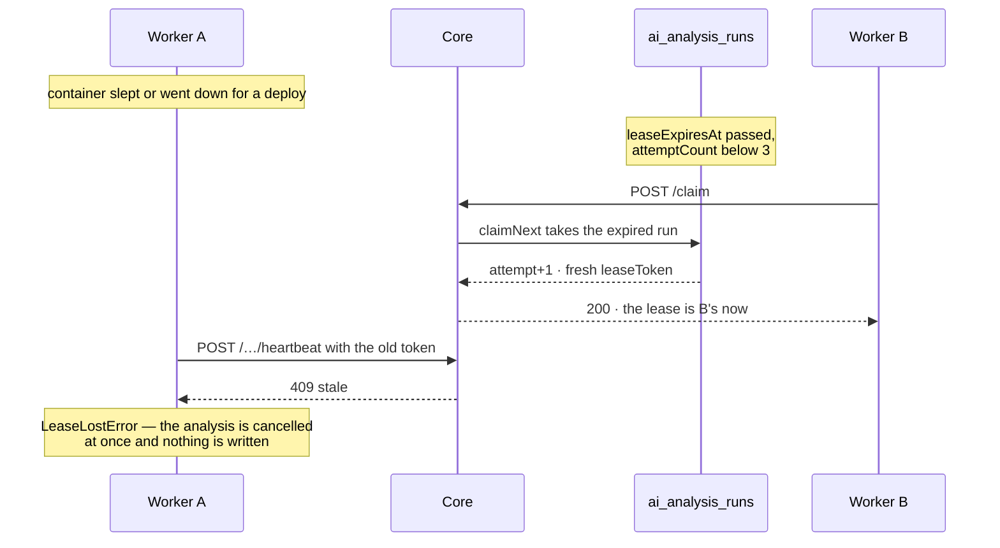
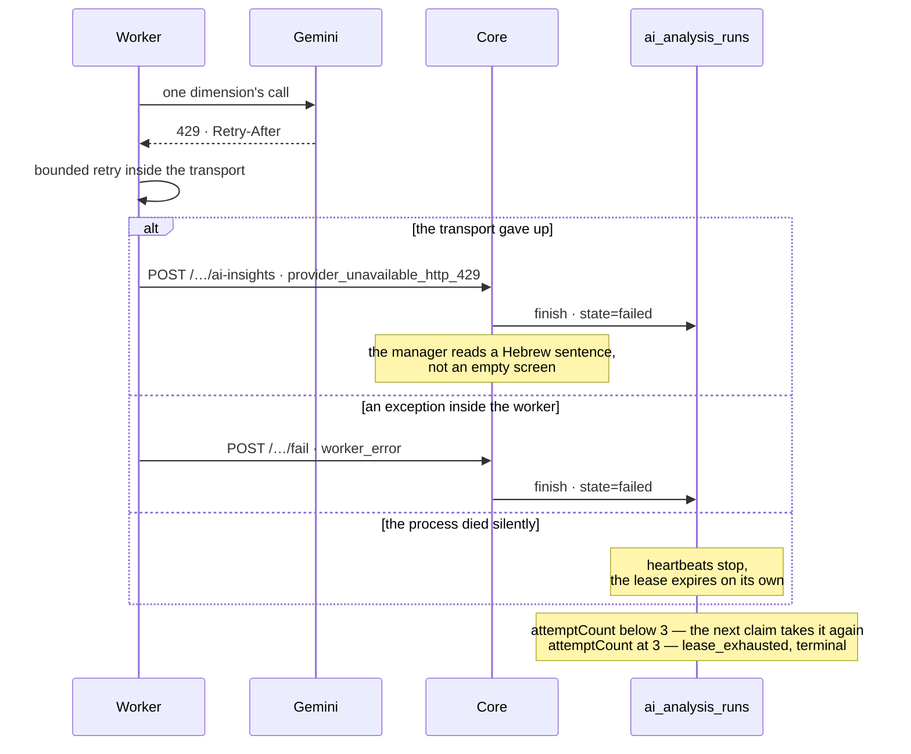
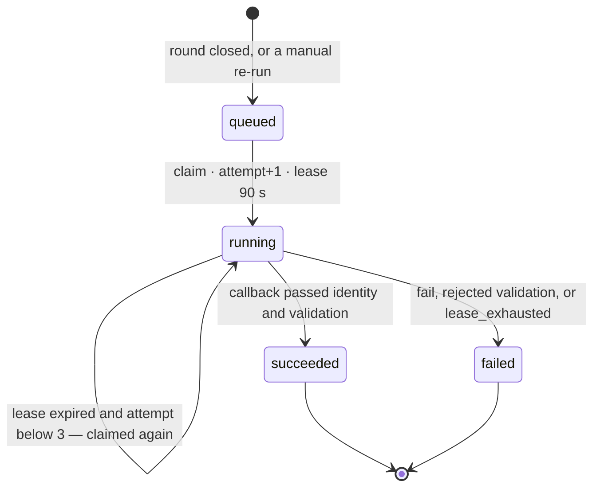

# The life of one AI analysis run

Living document. Implementation-level companion to
[`platform-handbook.md`](platform-handbook.md) §7, which tells the same story
without endpoint names: read that one first if the question is *why* the queue
exists, and this one if the question is what exactly goes over the wire.

The behaviour drawn here is owned by ADR-006, ADR-016 and ADR-017 in
[`../PROJECT_CONTEXT.md`](../PROJECT_CONTEXT.md); cross-service architecture is
in [`ai-analytics-handoff.md`](ai-analytics-handoff.md). Where a diagram and the
code disagree, the code is right and this file is what gets fixed.

## The shape

Two runtimes, one database, and the database belongs to Core alone. The Python
service holds no persistence: it reads aggregates through the MCP endpoint and
changes a run's state only through Core's HTTP endpoints.

## The ordinary path

```mermaid
sequenceDiagram
    autonumber
    actor M as Manager
    participant C as Core (Next.js)
    participant DB as ai_analysis_runs
    participant W as AI service (worker)
    participant G as Gemini

    M->>C: PATCH /api/rounds/… — close the round
    C->>C: responseCount against privacyThreshold
    Note over C: below the threshold — below_threshold,<br/>no run is created at all
    C->>DB: INSERT · state=queued · trigger=closure
    Note over DB: requestKey derived from the round's history;<br/>a partial unique index keeps one<br/>active run per round
    DB-->>C: run.id

    loop poll every 2 s
        W->>C: POST /api/ai-analysis-runs/claim
        alt queue empty
            C-->>W: 204 No Content
        else a run is eligible
            C->>DB: claimNext — conditional UPDATE
            DB-->>C: state=running · attempt+1 · lease +90 s
            C-->>W: 200 · run and leaseToken
        end
    end

    W->>C: MCP get_round_analytics
    C-->>W: aggregates only, no respondent row

    par heartbeat every 30 s
        W->>C: POST /…/heartbeat · leaseToken
        C->>DB: lease extended by another 90 s
        C-->>W: 200 running
    and the analysis itself
        W->>W: privacy gate, before the first token
        W->>G: roughly 30 calls across 8 dimensions
        G-->>W: Hebrew copy
        W->>W: safety validator · up to 3 repair passes
    end

    W->>C: POST /api/rounds/…/ai-insights + run-id and lease-token headers
    C->>C: identity first, then contract validation
    C->>DB: finish · state=succeeded · result
    C-->>W: 200
    M->>C: GET /api/rounds/…/ai-insights
    C-->>M: the Stone Map
```

The order at step 21 is deliberate. Identity is resolved before the payload is
validated — otherwise a callback aimed at the wrong round could mark a healthy
leased run as failed.

## The three branches the queue exists for

### Lease lost — the instance slept and another worker took the run



Worker A does not finish writing a result it no longer owns. Cancellation
happens at the next heartbeat, so at most 30 seconds after the lease changed
hands.

### The map arrived but did not match the contract

```mermaid
sequenceDiagram
    participant W as Worker
    participant C as Core
    participant DB as ai_analysis_runs

    W->>C: POST /…/ai-insights + run-id + lease-token
    C->>C: identity fine, contract schema not
    C->>DB: finish · state=failed · contract_validation_failed
    C-->>W: 400
    Note over C: the result is not stored;<br/>failureCode stays on the run row
    Note over W: 400 is not transient —<br/>delivery is not retried
```

Delivery retries distinguish a verdict from a lost connection: `400`, `404` and
`409` repeat the verdict and are not retried, while a timeout or a `5xx` gets
four attempts over roughly seven seconds — a budget deliberately shorter than the
lease it runs under.

### The provider failed, or the worker did



The third branch is the one nobody reports: if the process vanished, the row is
repaired only by the lease running out. That is what the heartbeat exists for.

## Run states



A retry is not a separate state: it is the same `running` row with an expired
lease becoming eligible again. Expiring the exhausted ones is part of claiming
rather than a separate collector — every `claim` first marks `lease_exhausted`
on whatever ran out of attempts, then looks for its own work. There is no cron.

## The numbers everything rests on

| What | Value | Name | Where |
| --- | --- | --- | --- |
| Poll interval | 2 s | `AI_JOB_POLL_INTERVAL_SECONDS` | `ai-analytics-service/src/config.py` |
| Heartbeat interval | 30 s | `AI_JOB_HEARTBEAT_INTERVAL_SECONDS` | `ai-analytics-service/src/config.py` |
| Lease length | 90 s | `AI_ANALYSIS_JOB_LEASE_MS` | `src/lib/server/ai-analysis-worker.ts` |
| Attempt ceiling | 3 | `AI_ANALYSIS_JOB_MAX_ATTEMPTS` | `src/lib/server/ai-analysis-worker.ts` |
| Delivery retries | 4, ≈7 s | `CALLBACK_MAX_ATTEMPTS` | `ai-analytics-service/src/services/result_sink.py` |
| Callback timeout | 5 s | `CALLBACK_TIMEOUT_SECONDS` | `ai-analytics-service/src/services/result_sink.py` |
| MCP timeout | 5 s | `MCP_REQUEST_TIMEOUT_SECONDS` | `ai-analytics-service/src/mcp_client/client.py` |
| Repair passes | up to 3 | `retry_count` | `ai-analytics-service/src/agents/graph.py` |
| Claim contention retries | 5 | `claimNext` | `src/lib/repositories/prisma/prisma-ai-analysis-run.repository.ts` |

## The surface between the two runtimes

Three separate secrets, and they are not interchangeable.

The table below is generated by `npm run docs:endpoints` from the routes in
`src/app/api` and the decorators in `ai-analytics-service/src/main.py`. Editing
it by hand is undone by the next run; `npm test` fails when the two disagree.
An endpoint the code has and this table does not is what happened on
2026-08-18, which is why it is no longer written by a person.

<!-- generated:endpoint-surface -->
| Direction | Endpoint | Secret | Answers |
| --- | --- | --- | --- |
| worker → Core | `POST /api/ai-analysis-runs/claim` | `AI_CALLBACK_SECRET` | 200 · 204 · 401 |
| worker → Core | `POST /api/ai-analysis-runs/:runId/heartbeat` | `AI_CALLBACK_SECRET` | 200 · 409 · 400 |
| worker → Core | `POST /api/ai-analysis-runs/:runId/fail` | `AI_CALLBACK_SECRET` | 200 · 404 · 409 |
| worker → Core | `POST /api/rounds/:roundId/ai-insights` | `AI_CALLBACK_SECRET` | 200 · 400 |
| worker → Core | `POST /api/mcp` | `MCP_SHARED_SECRET` | 200 |
| public | `GET /health` | none | 200 |
| public | `GET /api/v1/provider-status` | none | 200 |
| public | `GET /api/v1/fallback-status` | none | 200 |
| operator → worker | `GET /api/v1/provider-health` | `AI_WEBHOOK_SECRET` | 200 · 401 |
| Core → worker | `POST /api/v1/questions/suggest` | `AI_WEBHOOK_SECRET` | 200 |
| development only | `POST /api/v1/rounds/:round_id/analyze` | none | 200 · 404 outside development |
| legacy, dispatched by nothing | `POST /api/v1/webhook/events` | `AI_WEBHOOK_SECRET` | 202 · 401 · 503 |
<!-- /generated:endpoint-surface -->

The three public paths answer three different questions and are deliberately
separate documents rather than fields in one body: `/health` is whether this
instance is up, `/api/v1/provider-status` is whether the model is answering, and
`/api/v1/fallback-status` is whether the map is being written by the model at all
— a round whose last call succeeded reads `answering` while most of its
dimensions carry copy the service derived. They are separate paths rather than
fields in one body because each is meant to be read by its own free monitor, and
one shared body is how a change made for one of them quietly breaks the other.
Which of those monitors actually exists is operational state and lives in
[`shalomut-tracker-handoff.md`](shalomut-tracker-handoff.md), not here: an
endpoint existing and a monitor watching it are two different facts, and this
file only knows the first. The counts and the window behind the third stay behind
the secret on `/api/v1/provider-health`.

## What is deliberately absent from every diagram

`POST /api/v1/webhook/events` is a live endpoint on the Python side that runs the
same analysis **without** a `run_id` and `lease_token`, and Core accepts such a
callback on its legacy path. Core does not dispatch analysis that way: no sender
of `round_closed` or `analytics_requested` exists in `src/` outside tests, and
`AI_SERVICE_URL` survives only so `resolveAiServiceEndpoint` can derive the origin
for the question-suggestion endpoint. ADR-006 keeps the webhook as a rollback
boundary rather than a source of execution truth, which is why it appears in no
sequence above: work reaching Core through it is written with no run row, no
attempt count and no `failureCode`.
