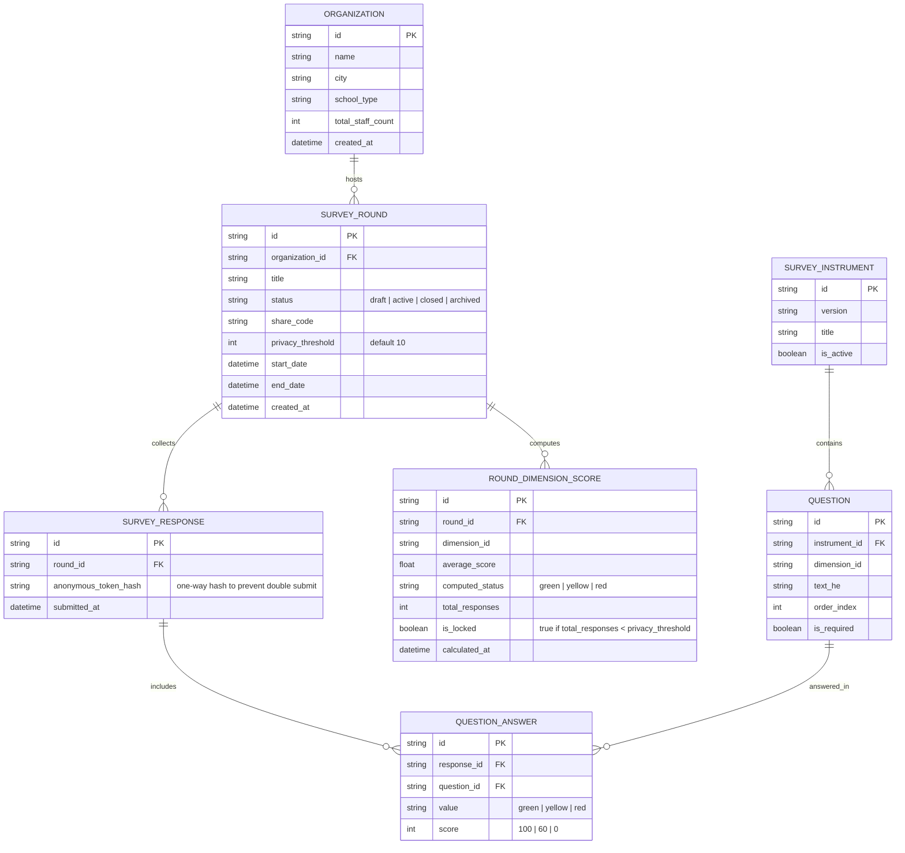

# Data Layer & Backend Services Blueprint (מפת שלומות)

**Дата создания**: 2026-07-24  
**Статус**: Имплементирован (Data Layer & Prisma Persistence Phase Completed)  
**Контекст**: Выделение чистого Data Layer и API-слоя.  
**Архитектурное решение (ADR-001)**: Вся аналитическая рефлексия, генерация выводов и рекомендации вынесены во внешний AI-сервис. Данный сервис выступает как чистый Data Layer & Raw Data Storage.

---

## 1. Итоги предыдущих этапов (Что сделано и зафиксировано)

### 🎨 Фронтенд & UX
- **Next.js 16 (App Router) + React 19 + Tailwind CSS v4**: Реализован весь пользовательский интерфейс для школы и респондентов.
- **RTL-First & Типографика**: Ивритский типографический стек (`Arial`, `Noto Sans Hebrew`), адаптивный `clamp()`, подпиксельное сглаживание.
- **WCAG AA Compliance**: Все цвета элементов и текст на органических камнях соответствуют контрасту > 4.5:1 (использован глубокий чернильный цвет `--ink: #383838`).
- **Интерактивная карта "Wellbeing Stones"**: Перетаскиваемые и кликабельные камни благополучия с визуализацией статусов (Зеленый, Желтый, Красный).
- **Экран опроса и билдер**: Интерфейс прохождения опроса респондентами и конструктор вопросов для директора.

### 📐 Каноническая методология (`src/lib/shalomut-source.ts`)
- **8 Измерений благополучия (Dimensions)**:
  1. `self-expression` (ביטוי עצמי) — Личный голос
  2. `professional-competence` (מסוגלות מקצועית) — Профессиональная уверенность
  3. `social-resource` (קשרים חברתיים) — Социальный ресурс / Коллеги
  4. `balance` (איזון) — Баланс нагрузки и времени
  5. `management-support` (עורף מקצועית / תמיכת הנהלה) — Поддержка руководства
  6. `certainty` (ודאות) — Определенность в рабочей среде
  7. `organizational-climate` (אקלים ארגוני) — Психологический климат
  8. `meaning` (משמעות) — Ощущение смысла работы
- **24 Вопроса** (по 3 на каждое измерение).
- **Трехуровневая шкала ответов**:
  - `green` (100 баллов) — "ההיגד משקף באופן מלא את מצבי" (Всё хорошо)
  - `yellow` (60 баллов) — "המצב סביר, אך יש נקודות שכדאי לתת להן תשומת לב" (Приемлемо)
  - `red` (0 баллов) — "ההיבט הזה יוצר מתח ודורש פעולה" (Требуется внимание)
- **Пороги агрегированного балла (Scoring Thresholds)**:
  - Зеленый: `75 - 100`
  - Желтый: `50 - 74`
  - Красный: `0 - 49`
- **Порог анонимности (Privacy Threshold)**: По умолчанию **10 ответов**. Если ответов меньше 10, карта и детальные результаты заблокированы для защиты анонимности участников.

---

## 2. Архитектура Data Layer и Data Models

Для последующей имплементации бэкенд-слоя определена следующая модель данных (ORM/Prisma/PostgreSQL/Supabase/MongoDB/Client Store):

---

## 3. Бэкенд Сервисы (Service Layer)

Интерфейсы сервисов, которые необходимо реализовать:

### 1. `OrganizationService`
- `createOrganization(data: CreateOrgInput): Promise<Organization>`
- `getOrganizationById(id: string): Promise<Organization>`
- `updateOrganization(id: string, data: UpdateOrgInput): Promise<Organization>`

### 2. `RoundService`
- `createRound(orgId: string, config: CreateRoundInput): Promise<SurveyRound>`
- `getActiveRoundByShareCode(code: string): Promise<SurveyRound>`
- `updateRoundStatus(roundId: string, status: RoundStatus): Promise<SurveyRound>`
- `getRoundStats(roundId: string): Promise<{ responseCount: number, isLocked: boolean }>`

### 3. `SurveyService` (Управление опросом & Сбор ответов)
- `getQuestionnaireForRound(shareCode: string): Promise<SurveyQuestionnaire>`
- `submitSurveyResponse(roundId: string, answers: QuestionAnswerInput[], tokenHash?: string): Promise<SubmitResult>`
  - **Защита анонимности**: Никакие персональные данные (IP, Email, Имя) не сохраняются с ответами.
  - **Контроль повторов**: Хэш сессии/токена сохраняется без привязки к конкретным ответам.

### 4. `AnalyticsService` (Расчет баллов и агрегация)
- `calculateRoundScores(roundId: string): Promise<RoundAnalyticsResult>`
  - **Правило блокировки**: Если `responseCount < round.privacy_threshold`, возвращает `isLocked: true` и скрывает детальные распределения баллов.
  - **Алгоритм расчета**:
    $$\text{DimensionScore} = \frac{\sum \text{Score}_i}{N_{\text{answers}}}$$
    Где `Score` $\in \{100, 60, 0\}$.

### 5. `RecommendationService` (Рекомендации для директоров)
- `getRecommendationsForDimension(dimensionId: string, status: WellbeingStatus): Promise<ActionRecommendation[]>`

---

## 4. REST / Server Actions API Routes Structure

Будущая структура API в Next.js App Router (`src/app/api/` или React Server Actions):

- `POST /api/rounds` — создание раунда опроса
- `GET /api/survey/[shareCode]` — получение анкеты по коду
- `POST /api/survey/[shareCode]/submit` — отправка результатов опроса
- `GET /api/rounds/[roundId]/analytics` — получение агрегированной карты и баллов (с проверкой порога анонимности)
- `GET /api/rounds/[roundId]/recommendations` — получение рекомендаций по действиям

---

## 5. Чек-лист для следующей сессии

1. [x] Выбрано хранилище: Prisma + PostgreSQL/Supabase; empty in-memory repositories используются только без настроенной persistence.
2. [x] Имплементированы organization, round и survey repository interfaces/adapters; агрегация находится в `AnalyticsService`.
3. [ ] Подключить manager-facing UI к Data Layer. Скрытый demo fallback запрещён; явный static-demo режим можно сохранить отдельно.
4. [x] Добавлены интеграционные тесты агрегации, privacy threshold и empty-runtime поведения.
