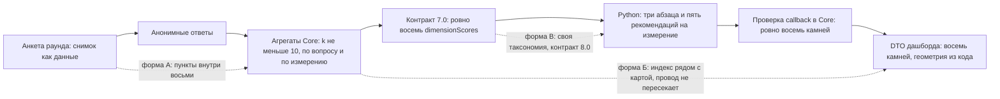

# Доменные модули поверх существующей архитектуры — исследование 2026-09-13

Дата: 2026-09-13; §9 и §10 добавлены 2026-09-14.
Снимок: `1cd6591` (`main`, после того как контракт `7.0` и 126-пунктный
инструмент стали дефолтом 2026-09-12 и были задеплоены 2026-09-13).
Статус: **read-only исследование, не для реализации.** Ни одно решение из него
не принято; оно оценивает варианты и рекомендует один, как
[`questionnaire-modularity-audit-2026-08-16.md`](questionnaire-modularity-audit-2026-08-16.md)
и [`product-strategy-axes-2026-08-10.md`](product-strategy-axes-2026-08-10.md).
Ссылки `path:line` — на этот снимок и уплывут вместе с кодом.

## Вопрос владельца

Можно ли на существующей архитектуре построить новые доменные модули:

```text
Organizational Domain
├── Delivery risk
├── Team overload
├── Bottlenecks
├── Organizational friction
├── Onboarding
├── Knowledge concentration
├── Attrition indicators
└── Wellbeing
```

И два вопроса поверх: какие доменные модули ввёл бы агент, и какие из них
имеют наибольший вес в организациях.

## Как это получено, и чего это стоит

- Прочитаны оба рантайма по границе «измерение»: загрузчик манифеста,
  парсер анкеты, агрегация, кодировщик, контракт `7.0`, проверка callback,
  презентация карты; на стороне Python — `contracts.py`, парсер MCP,
  исходящая проверка, каталог рекомендаций, лексикон тем, промпты.
- Прочитаны ADR-001–005, 011, 022, 024, 030, 037, 056, аудит модульности
  2026-08-16, стратегический обзор 2026-08-10, исследование доказательного
  слоя 2026-08-09 (§1.4, §2, §3, §5), план инструмента 2026-08-14 и анализ
  маппинга 2026-09-12.
- **Две пробы исполнены на отгруженном коде**, не прочитаны (§1.3). Это
  самое сильное свидетельство в документе.
- Два фоновых агента собрали внешнюю базу: вес доменов по мета-анализам и
  устройство модулей у аналогов (§4, §5).

Три метки, как в документах 2026-08-10 и 2026-09-12:

- **[проверено]** — прочитано в репозитории в этой сессии, с указанием места.
- **[исполнено]** — получено запуском отгруженного кода в этой сессии.
- **[по исследованию]** — из веб-исследования агента; первоисточник не
  подтверждён здесь. Ориентир для решения, не факт для действия.

Ничего не проверялось на задеплоенной среде, и не требовалось: каждый вывод —
о структуре исходников.

## Краткий ответ

**Да для пяти модулей из восьми, нет для трёх — и «да» имеет три формы, цена
которых различается на порядок на каждом шаге.**

Архитектура — это конвейер *анонимный самоотчёт → k-анонимные агрегаты
(k ≥ 10) → фиксированная таксономия из восьми измерений → нарратив и каталог
рекомендаций по измерению*. Анкета в нём — данные, восьмёрка — код в обоих
рантаймах, и это не случайность, а записанный в шести документах инвариант.

| Модуль | Что это по природе | На этой архитектуре |
| --- | --- | --- |
| Wellbeing | самоотчёт | **да** — уже внутри: SMBM (14 пунктов) лежит в `balance`; не хватает отдельного «индекса выгорания» |
| Team overload | самоотчёт | **да** — уже внутри `balance` (A1, A2, A4, A5, A13, D1–D4…); «по командам» — только там, где в команде ≥ 10 человек |
| Organizational friction | самоотчёт (воспринимаемые помехи) | **да** — уже внутри `certainty` и `management-support` (A3, A6, A10, A12, A19, D3) |
| Attrition indicators | самоотчёт (намерение уйти) | **да, только на уровне группы** — D12, D13 собираются и намеренно не оцениваются; индивидуальный «риск ухода» исключён инвариантом приватности |
| Onboarding | самоотчёт + стаж | **да, с оговоркой** — разбивка по стажу «0–2» уже есть; у школы новичков обычно < 10, и ячейка будет подавлена |
| Delivery risk | системные данные (проекты, потоки) | **нет** — самоотчёт даёт слабо валидированную прокси; интеграции = новые субпроцессоры и идентифицируемые данные |
| Bottlenecks | процессные/сетевые данные | **нет как модуль** — воспринимаемые «ожидания» уместны как пункты внутри friction |
| Knowledge concentration | реляционные данные (кто что знает) | **нет** — измеряется bus factor по репозиториям или ONA с именами; и то и другое несовместимо с анонимностью продукта |

Три формы «модуля» (§2): **А** — блок пунктов внутри восьми (только контент,
уже так и есть для четырёх модулей); **Б** — именованный индекс *рядом с
картой*, считается в Core под тем же порогом и не пересекает границу ИИ
(один слайс в Core, ~10–12 файлов, без новой версии контракта); **В** —
подключаемая таксономия, то есть «домен» как второй набор камней (оба
рантайма, контракт `8.0`, ~37 + 16 файлов, генерируемая геометрия карты,
новый каталог из 192 записей и новые промпты — и отмена инварианта).

**Рекомендация агента (§6):** делать форму Б для трёх индексов, о которых
анализ 2026-09-12 уже просил — выгорание, намерение уйти, парная диаграмма
сеток нагрузки, — плюс «сигнальные пункты» для психологической безопасности.
Не делать форму В для школ. Не делать индивидуальный риск ухода никогда. Три
модуля из списка (delivery risk, bottlenecks, knowledge concentration) — не
для этого продукта, пока он остаётся анонимным опросом. Внешняя база (§4)
меняет порядок, не состав: самый сильный организационный рычаг — поддержка
руководства, и она уже камень; нагрузка — слабейший прямой предиктор ухода,
её место — причина выгорания, а не самостоятельный прогноз. Если аудитория —
коммерческая организация, преграда тоже не таксономия, а контент, модель
организации и язык — §9. Интеграционный модуль, читающий системы клиента
и отправляющий сигналы в ИИ, — месяцы, и цена не в коде: он ломает
обещание «ни одной идентифицируемой записи у вендора» — §10.

---

## 1. Что архитектура умеет сегодня — карта фактов

### 1.1 Конвейер, и где в нём данные, а где код [проверено]



| Данные (меняются без кода) | Код (в обоих рантаймах) |
| --- | --- |
| Список вопросов, их тексты, ID, порядок — `SurveyRound.surveyDefinition` ([`prisma/schema.prisma:127`](../prisma/schema.prisma#L127)) | Множество из восьми `dimensionId`: union и список [`wellbeing-dimensions.ts:14, 28`](../src/lib/wellbeing-dimensions.ts#L14), загрузчик [`:97-101`](../src/lib/wellbeing-dimensions.ts#L97); Python — кортеж из замороженного манифеста `2.0` [`contracts.py:50`](../ai-analytics-service/src/contracts.py#L50) |
| Шкала и полярность каждого пункта — реестр из четырёх шкал [`answer-scales.ts:19-24`](../src/lib/survey/answer-scales.ts#L19) | Геометрия восьми камней, подобранная вручную — `Record<WellbeingDimensionId, DimensionMapPlacement>` [`dimension-presentation.ts:81`](../src/lib/dashboard/dimension-presentation.ts#L81) |
| Секции анкеты (`sectionId`) — но «только презентация: ничего не считается и не агрегируется по секции» [`backend.ts:71`](../src/lib/types/backend.ts#L71) | Каталог рекомендаций: 192 записи = 8 измерений × 3 статуса × 8 ([`data/interventions_kb.json`](../ai-analytics-service/data/interventions_kb.json), пересчитано) |
| Фоновые вопросы: демография, сетки, неоцениваемые утверждения (`kind: background`) | Промпты с персоной «организационный психолог … о благополучии *педагогического* коллектива» [`hebrew_prompts.py:256`](../ai-analytics-service/src/services/hebrew_prompts.py#L256) |
| Идентичность инструмента (`instrumentId`) [`backend.ts:156`](../src/lib/types/backend.ts#L156) | Лексикон тем на школьном иврите [`rag/topics.py`](../ai-analytics-service/src/rag/topics.py) |
| Полосы статусов — `contracts/scoring-bands.json`, один файл на оба рантайма | Enum измерений в OpenAPI [`openapi.yaml:1577`](openapi.yaml#L1577), цели (`RoundGoal.dimensionId`), сравнение раундов (`Record<WellbeingDimensionId, number>`) |
| Тексты восьми измерений — `contracts/wellbeing-dimensions.json` (**ровно восемь**, загрузчик отказывает иному числу) | Проверка callback: «Stone Map must contain exactly the eight canonical dimensions» [`ai-contract.ts:1155`](../src/lib/ai-contract.ts#L1155) |

Итог аудита 2026-08-16 держится и на сегодняшнем `main`: список вопросов —
данные, шкала — данные (с 2026-08-15), а *набор измерений* — код. Что
добавилось с тех пор: полярность, фоновые вопросы, секции, `instrumentId`,
контракт `7.0`. Ничто из этого не сдвинуло восьмёрку.

### 1.2 Где именно восьмёрка закреплена [проверено]

Не одно место, а цепочка, в которой каждое звено само по себе достаточно,
чтобы девятое измерение не прошло:

| Звено | Core | Python |
| --- | --- | --- |
| Тип и манифест | union из восьми литералов; загрузчик отказывает манифесту с ≠ 8 записями или иным порядком [`wellbeing-dimensions.ts:97-116`](../src/lib/wellbeing-dimensions.ts#L97) | `AI_ANALYTICS_DIMENSION_IDS` читается из замороженного `ai-analytics-v2.json`; при импорте утверждается, что все семь манифестов несут тот же список [`contracts.py:50-100`](../ai-analytics-service/src/contracts.py#L50) |
| Парсер анкеты | `validDimensionIds` строится из глобального `surveyInstrument.dimensions` [`survey-definition.ts:392`](../src/lib/survey-definition.ts#L392); чужой id → «Survey contains an invalid question.» | — |
| Активация | «Enabled survey questions must cover all eight dimensions before activation.» [`survey-definition.ts:450`](../src/lib/survey-definition.ts#L450), `isActivatableSurveyDefinition` [`:611`](../src/lib/survey-definition.ts#L611) | — |
| Агрегация | цикл `for (const dimension of surveyInstrument.dimensions)` [`analytics.service.ts:461`](../src/lib/services/analytics.service.ts#L461) | входной парсер: «requires exactly eight canonical dimension scores» [`mcp_types.py:525`](../ai-analytics-service/src/schemas/mcp_types.py#L525), «must cover all eight» [`:583`](../ai-analytics-service/src/schemas/mcp_types.py#L583) |
| Выход ИИ | callback: ровно восемь камней [`ai-contract.ts:1155`](../src/lib/ai-contract.ts#L1155) | исходящая проверка: `sorted(stones.keys()) != sorted(AI_ANALYTICS_DIMENSION_IDS)` [`stone_map_validation.py:326`](../ai-analytics-service/src/schemas/stone_map_validation.py#L326); «requires exactly eight stones» [`analytics_output.py:71`](../ai-analytics-service/src/schemas/analytics_output.py#L71) |
| Экран | карта, разбивка, страницы измерений итерируют `dimensionPresentations` (Record из восьми) | подсказка вопросов: `dimensionId not in AI_ANALYTICS_DIMENSION_IDS` [`main.py:309`](../ai-analytics-service/src/main.py#L309) |
| Повторный прогон | `regenerateDimensionIds` проверяется против восьми контракта (ADR-024) | — |

Масштаб: **37 файлов Core вне тестов** и **16 файлов Python** называют тип
или список измерений (`grep` на этом снимке); **16 мест** строят
`Record<WellbeingDimensionId, …>`. Аудит 2026-08-16 насчитал «~14 сайтов» —
с тех пор восьмёрка расползлась шире, потому что появились цели, сравнение
раундов, разбивка и повторный прогон по измерению. Его вывод «компилятор
молчит» тоже держится: каждый `Record` собран через `as`-cast, исчерпывающего
`switch` по измерениям нет.

### 1.3 Пробы [исполнено]

Core, `npx tsx` против `1cd6591`, скрипт вне репозитория:

| Проба | Результат |
| --- | --- |
| Один аналитический вопрос дефолтного инструмента привязан к `delivery-risk` | `parseSurveyDefinition` → `{"ok":false,"error":"Survey contains an invalid question."}` |
| Анкета из одного модуля — оставлены только пункты `balance` | мягкий парсинг `ok: true`, `isActivatableSurveyDefinition` → **false**; строгий парсинг → «Enabled survey questions must cover all eight dimensions before activation.» |
| Манифест текстов с девятой записью | `loadDimensionTexts` → «Dimension texts manifest must define exactly 8 dimensions, not 9» |
| Манифест с семью | «… not 7» |
| Пересчёт дефолтного инструмента из данных | 150 хранимых вопросов: **78 аналитических** (balance 36, certainty 9, social-resource 7, meaning 7, organizational-climate 6, management-support 5, professional-competence 5, self-expression 3) и **72 фоновых** (16 демографии, 26 строк сеток, 30 неоцениваемых утверждений) |

Python, `ai-analytics-service/.venv/bin/python`, позитивный кейс `7.0` из
`contracts/fixtures/golden_corpus.json`:

| Проба | Результат `RoundAnalyticsResult.from_dict` |
| --- | --- |
| Неизменённый payload | принят |
| Девятая запись в `dimensionScores` (`delivery-risk`) | `ValueError: Dynamic AI analytics contract requires exactly eight canonical dimension scores` |
| Один агрегат вопроса привязан к `delivery-risk` | `ValueError: Question aggregate 'q-0' must use a supported dimension` |
| Семь измерений | тот же отказ «exactly eight» |

Вывод из проб, который стоит нести дальше: **модуль как отдельный набор
измерений не проходит ни одну границу** — ни сохранение, ни активацию, ни
провод, ни callback. А **модуль как блок пунктов внутри восьми проходит все
границы без единой правки** — это и есть то, чем 126-пунктный инструмент уже
является.

### 1.4 Что инструмент уже держит для каждого предложенного модуля [проверено]

Пункты — по [`research-instrument.ts`](../src/lib/research-instrument.ts)
(блоки: A требования `:278`, B ресурсы `:324`, C выгорание `:375`,
D исходы `:403`, короткие блоки `:436`, фон `:145`). Куда пункт ложится —
по маппингу 2026-09-12 §2, принятому владельцем как рабочий.

| Модуль | Пункты в инструменте | Куда ложатся сегодня | Чего нет |
| --- | --- | --- | --- |
| Wellbeing | C1–C14 — Shirom–Melamed Burnout Measure, 1–7; D16, D17, D19, D20, H1, H2 — восстановление и интерференция; E1, E2 аффект; K1–K3 симптомы; M1 удовлетворённость жизнью | SMBM и восстановление → `balance` (−); аффект, симптомы, удовлетворённость — **не в оценку** | отдельного «индекса выгорания» нет; анализ 2026-09-12, примечание 3, называет его будущим свойством и платит за его отсутствие тем, что `balance` «читается как истощение» |
| Team overload | A1 לחץ זמן, A2 עומס מטלות, A4 часы сверх ставки, A5 ожидание доступности, A13 нехватка людей; B5, B19, B20 передышки и восстановление; D1–D4, D7, D21 последствия перегрузки; две сетки «время / нагрузка» по 13 компонентам; фон: часы в день, работа вне часов, доля ставки | всё оцениваемое → `balance`; сетки собираются и **нигде не показываются** (анализ §4) | разреза «по команде»: нет фонового вопроса «команда/кафедра», есть только роль (три варианта) |
| Organizational friction | A3 противоречивые требования, A6 срочное и непредвиденное, A10 неясные роль и ответственность, A18 частые изменения, A19 плохая оргкоммуникация; A8, A12 отношения с руководством и вмешательство; D3 работа без прерываний; B3 прозрачность изменений (+) | `certainty` (A3, A6, A10, A18, A19, B3), `management-support` (A8, A12), `balance` (D3) | конструкт рассыпан по трём камням и не читается как одно число |
| Attrition indicators | D12 «думаю уйти из школы», D13 «думаю уйти из профессии»; D9, D10 отсутствия; A16a незащищённость занятости | D12, D13, D9, D10 — **намеренно не в оценку** («исходы — не условия», примечание 4); A16a → `certainty` | доли «думающих уйти» нигде нет — самый важный показатель инициативы («около 33% новых педагогов увольняются в первые 3–5 лет», [`product-requirements-summary.md:10`](product-requirements-summary.md#L10)) собирается и не показывается |
| Onboarding | фон: стаж в школе и в профессии по полосам `0–2 / 3–8 / 9–14 / מעל 15` [`:142`](../src/lib/research-instrument.ts#L142); `backgroundContext.newStaffMembers` вводит руководитель при настройке раунда | разбивка `/breakdown` по стажу уже существует и написана ровно под вопрос «наши новички ниже по принадлежности?» [`background-breakdown.ts:22`](../src/lib/analytics/background-breakdown.ts#L22); лексикон каталога знает тему `onboarding` (`חדש`, `קליטה`, `חונך`) | пунктов о социализации (наставник, ясность ожиданий в первый год) нет; группа «0–2» в школе на 30–60 человек обычно < 10 и **подавляется** |
| Delivery risk | ближайшее: D1 «не успеваю реализовать учебную программу», D14 «трудно достигать целей» | `balance`, `professional-competence` | конструкта нет; в школе он и не самоотчётный |
| Bottlenecks | ближайшее: A6, D3, A19 | `certainty`, `balance` | пунктов «работа ждёт одного человека / одобрения» нет |
| Knowledge concentration | ничего | — | ничего, и добавить нельзя без имён (см. §3.8) |

### 1.5 Машинерия приватности, которую переиспользует любой групповой модуль [проверено]

- **Порог — свойство раунда, не экрана.** `MINIMUM_PRIVACY_THRESHOLD = 10`
  [`survey-definition.ts:25`](../src/lib/survey-definition.ts#L25); ниже —
  по итогу и по любому аналитическому вопросу — всё заперто, провайдер не
  вызывается (ADR-004, ADR-005).
- **Ячейка защищена отдельно от столбца.** `suppressFrequency` и
  `suppressCrossTab` ([`cell-suppression.ts:232, 381`](../src/lib/privacy/cell-suppression.ts#L232))
  гарантируют, что подавленная ячейка не восстанавливается вычитанием — в
  каждой строке скрыто либо ничего, либо не меньше порога (ADR-037). Группа
  «не ответившие» — именованная категория с тем же правилом.
- **Один базис расчёта на раунд** (ADR-022, ADR-030): раунд публикует числа,
  когда закрывается; ни один экран не выделяет подмножество респондентов.
  Групповая разбивка по *фоновому* вопросу — не нарушение: она k-анонимна и
  считается на том же базисе.
- **Фоновые ответы не пересекают границу ИИ** (`backgroundQuestionsCrossTheBoundary: false` в `7.0`;
  `analytics.service.ts` фильтрует `isAnalyticQuestion` перед агрегацией).
- **Никаких строк по респонденту нигде** — ни на экране, ни в payload, ни в
  логе.

Арифметика, которая из этого следует для «командных» модулей: школа на
30–60 человек делится на кафедры по 3–8; **ни одна такая ячейка не будет
опубликована**, а её дополнение — тоже, потому что вычитание из известного
итога запрещено. «Team overload по командам» имеет смысл там, где команда —
это ≥ 10 ответивших, то есть в организации на сотни людей или на уровне
сети школ. Второе — другой правовой режим (стратегический обзор, ось 1:
объединение данных школ ставит под вопрос исключение для «внутреннего
исследования»).

### 1.6 Что в системе школьное, а не «организационное» [проверено]

Если «Organizational Domain» означает вторую аудиторию — компании, а не
школы, — то помимо кода меняется контент, и его больше:

- персона промпта — «психолог … о благополучии *педагогического* коллектива»
  [`hebrew_prompts.py:256`](../ai-analytics-service/src/services/hebrew_prompts.py#L256);
  11 строк промптов называют школу, учителей или учеников;
- каталог: **60 из 192** записей называют учеников, родителей, класс, урок или
  учительскую (пересчитано по `title + summary + actionable_steps`);
- лексикон тем — школьный иврит (`תלמידים`, `הורים`, `כיתה`, `מבחנים`);
- `Organization.schoolType`, `PRODUCT.md` §Users — директора, координаторы
  благополучия, учителя;
- стоп-линия контракта динамической анкеты: «не превращать сервис в
  general-purpose survey analyzer вне продуктовой wellbeing domain»
  ([`dynamic-questionnaire-ai-contract.md`](dynamic-questionnaire-ai-contract.md) §Non-goals).

---

## 2. Три формы «модуля», с ценой

| Форма | Что это | Что трогает | Контракт | Порядок цены | Чего не может |
| --- | --- | --- | --- | --- | --- |
| **А. Блок внутри восьми** | секция анкеты, чьи пункты привязаны к существующим измерениям | только данные: `research-instrument.ts` или конструктор | нет | часы, контент | у модуля нет своего числа: он растворяется в камне |
| **Б. Индекс рядом с картой** | именованный набор пунктов со своим агрегатом под тем же k ≥ 10, показанный рядом с картой; не камень, не пересекает провод | ~10–12 файлов Core, один экран | нет, пока индекс не уходит в ИИ | дни, один слайс | не получает нарратива и рекомендаций от модели |
| **В. Подключаемая таксономия** | «домен» = свой набор камней, свой каталог, своя персона | 37 + 16 файлов в двух рантаймах, геометрия карты, каталог, промпты, лексикон, шесть документов с инвариантом | **`8.0`**, consumer-first | недели + контент, которого нет | ничего — но платит за всё |

### 2.1 Форма А — то, что уже сделано

Четыре модуля из восьми уже стоят в инструменте в этой форме (§1.4):
перегрузка, трение, выгорание и — через стаж — онбординг. Стоимость
добавить пятый блок — авторство пунктов и строка в маппинге методолога;
парсер, хранение, рендер по блокам, оценка с полярностью и агрегация примут
их без правок (аудит 2026-08-16 §1 доказал это исполнением на 128-пунктной
выдуманной анкете, и с тех пор тем же путём прошёл настоящий инструмент).

Предел формы А назван в анализе 2026-09-12 дважды и одним словом —
«растворяется». SMBM в `balance` делает камень «истощением», а не
«соотношением задач и времени» (примечание 3); D12/D13 нельзя положить ни в
один камень, потому что исход не говорит, *какая* сторона среды виновата
(примечание 4). Модуль без собственного числа — это не модуль, а тема.

### 2.2 Форма Б — индекс рядом с картой

**Определение.** Объявленный набор пунктов (аналитических *и*
неоцениваемых), по которому Core считает свой агрегат — среднее
нормированных баллов или долю ответов выше порога — на том же базисе и под
тем же порогом, что и камни, и показывает рядом с картой как число с
подписью, не как камень. В ИИ он не уходит.

**Что уже есть [проверено].**

- Секции — но `sectionId` объявлен презентационным и не агрегируется
  ([`backend.ts:71`](../src/lib/types/backend.ts#L71)); индексу нужна своя
  привязка, а не секция, потому что индекс режет поперёк блоков (выгорание +
  восстановление, D12 + D13).
- Неоцениваемые Likert-пункты хранят шаг шкалы как значение, но `score` у
  них отсутствует ([`backend.ts:200-205`](../src/lib/types/backend.ts#L200));
  шкала восстанавливается из опций через `scaleMatchingOptions`
  ([`answer-scales.ts`](../src/lib/survey/answer-scales.ts)). Индекс по
  D12/D13 считает балл сам — это одна функция.
- Единственная точка чтения ответов `readAnalyticAnswers`
  ([`analytic-answers.ts`](../src/lib/analytics/analytic-answers.ts)) —
  индекс встаёт в тот же проход `calculateDynamicRoundAnalytics`, чтобы у
  раунда остался один базис (ADR-030).
- `suppressFrequency` — для «доли выше порога» и для разбивки индекса по
  фоновому вопросу.
- `publishedAnalytics` — хранимая копия; индекс становится её полем, и
  `stillTheSameBasis` не меняется (хеш измерения уже покрывает шкалу и
  полярность; привязку к индексу надо в него добавить, иначе два раунда с
  разным составом индекса сравнятся как один инструмент — та же ошибка, что
  аудит нашёл у `scaleId`).

**Что надо тронуть** (оценка по чтению, не по выполнению): `types/backend.ts`
(атрибут привязки на вопросе, тип агрегата), `survey-definition.ts` (парсер
собирает из белого списка — новое поле надо назвать, иначе оно молча
теряется, как `templateId` в аудите), `research-instrument.ts` (объявить
привязки), `survey-definition-hash.ts` (хеш измерения), `analytics.service.ts`
(расчёт), `types/canonical-analytics.ts`, `published-analytics.ts`,
`round-analytics-payload.ts` + `docs/openapi.yaml` + генерация JSON,
`analytics-encoder.ts` (явно *не* отправлять — как `measurementSnapshotHash`),
один компонент экрана и контекст менеджера, тесты. Конструктор — по
желанию: сначала привязки авторятся в данных, как весь инструмент.

**Почему без версии контракта.** Индекс — факт Core, как разбивка по
демографии, и ADR-005 уже провёл ту же границу для фона: «ИИ просят прочесть
восемь оценок измерений; полоса зарплаты ничего к этому не добавляет». Если
однажды захочется, чтобы модель *учитывала* индекс в общем резюме, это
изменит промпт и смысл — новая версия по ADR-002, не поправка. Здесь этого
не предлагается.

**Кому подходит.** Wellbeing (индекс выгорания), Attrition (доля думающих
уйти), Team overload (индекс требований + парная диаграмма сеток),
Friction (индекс ограничений + сигнальные пункты A9, A11), Onboarding (блок
из 4–6 пунктов + разбивка по стажу). Все пять — на данных, которые уже
собираются.

### 2.3 Форма В — подключаемая таксономия

Это сценарий (d) аудита 2026-08-16, только шире, потому что «домен» — это не
восемь других камней, а восемь других камней **плюс** их каталог, персона и
геометрия. Что должно измениться, по звеньям §1.2:

*Core.* Union и загрузчик → строки времени выполнения, читаемые из
доменного манифеста; 16 `Record<WellbeingDimensionId, …>` и 37 файлов;
`validDimensionIds` и покрытие — из снимка раунда, а не из глобала
(`survey-definition.ts:392, 450, 611`); циклы агрегации
(`analytics.service.ts:220, 461`); проверка callback (`ai-contract.ts:1155`);
enum OpenAPI; цели, сравнение раундов, разбивка, повторный прогон;
**геометрия карты** — восемь органических форм, подобранных вручную, с
e2e-проверкой углов каждого камня (`e2e/dashboard-map.spec.ts`), для N
камней нужна генерируемая раскладка, то есть новая работа дизайнера, а не
только кода.

*Python.* `contracts.py` утверждает одну восьмёрку на семь манифестов и
падает при импорте от иного — становится проверкой против списка,
объявленного в payload; `mcp_types.py:525, 583, 619`,
`stone_map_validation.py:326`, `analytics_output.py:71`, `main.py:309`;
`AI_ANALYTICS_DIMENSION_NAMES_HEBREW` в промптах; каталог, ключуемый по
домену — **192 рукописные записи на домен** (у нынешних нет владельца,
рецензента и шага проверки — исследование 2026-08-09 §2); персона и
лексикон на домен.

*Контракт.* `8.0` с объявленным списком измерений в payload и флагом в
`capabilities.json`; consumer-first по матрице версий; отдельная refusal-suite
(`lint:contract-refusals`). `1.0`–`7.0` не трогаются.

*Инвариант.* «Восемь измерений — стабильная таксономия дашборда» записан в
ADR-004, инварианте разработки 3, `source-of-truth.md` §Canonical Decisions,
`PRODUCT.md`, обоих скиллах и стоп-линии контракта динамической анкеты.
Это не техническая преграда, а **решение владельца**, которое надо отменить
явно, прежде чем первый файл будет тронут.

Когда форма В права: только если продукт должен обслуживать вторую аудиторию
с другим языком результата. И тогда узкое место — не код, а контент: каталог
и промпты на домен стоят дороже 53 файлов и не могут быть написаны агентом
без владельца методологии.

---

## 3. Восемь модулей по одному

Для каждого: что это как конструкт, чем измеряется в литературе
(§4, [по исследованию]), что уже есть [проверено], какая форма подходит, что
с ним делает порог в школе, вердикт.

### 3.1 Wellbeing

Продукт целиком; вопрос только в том, где показать выгорание отдельно от
условий. SMBM — самая валидированная часть инструмента (14 пунктов, 1–7,
три подшкалы: физическое истощение C1–C6, когнитивная усталость C7–C11,
эмоциональное истощение C12–C14). Сегодня все 14 в `balance` с обратной
полярностью — «вариант А» примечания 3, принятый на пилот с оговоркой.
**Форма Б: индекс выгорания** — среднее нормированных баллов SMBM, с
подшкалами, рядом с картой; `balance` при этом можно оставить как есть или
вернуть к 22 пунктам об условиях (вариант Б примечания 3) — это решение
методолога, не архитектуры. Порог не мешает: индекс по всему раунду.
**Вердикт: да, форма Б, первым.**

### 3.2 Team overload

Конструкт JD-R «требования»: темп, объём, часы, доступность, нехватка
людей. В инструменте — самый плотный блок: A1, A2, A4, A5, A13, плюс
последствия D1–D4, D7, D21 и две сетки, у которых диагностическая ценность —
в **разности** доли нагрузки и доли времени по компоненту (анализ §4).
Форма А уже есть. **Форма Б** даёт два новых экрана на собранных данных:
индекс требований (A1–A5, A13) отдельно от восстановления (B5, B19, B20, H1,
H2), и парную диаграмму сеток. «По командам» — см. §1.5: в школе ячейки
кафедр подавлены; нужен фоновый вопрос «команда» (его нет) и организация,
где команда ≥ 10. **Вердикт: да; как школьный модуль — на уровне раунда, не
команды.**

### 3.3 Organizational friction

Воспринимаемые организационные помехи: противоречивые требования, неясная
роль, срочное и внезапное, плохая коммуникация, вмешательство сверху,
прерывания. В литературе это Organizational Constraints Scale (Spector &
Jex) и ролевые шкалы Rizzo — самоотчёт, хорошо валидированный (§4). В
инструменте пункты есть (A3, A6, A10, A18, A19, A12, A8, D3, B3), но
рассыпаны по `certainty`, `management-support` и `balance`. **Форма Б:
индекс ограничений** из этих пунктов. Сюда же — **сигнальные пункты** A9
(оскорбительное обращение) и A11 (домогательства): для них среднее —
неправильная статистика (примечание 1), нужна доля ответов выше «כלל לא»;
это тот же механизм индекса с другой функцией агрегации. **Вердикт: да,
форма Б; bottlenecks — подмножество этого модуля, не отдельный.**

### 3.4 Attrition indicators

Самый сильный проксимальный предиктор ухода — намерение уйти (§4); D12 и
D13 — ровно он, в двух формах (из школы, из профессии). Сегодня они
собираются и намеренно не окрашивают камень, потому что исход не называет
причину — и это правильно для камня и неправильно для инициативы, чья
цель сформулирована через уход новых учителей. **Форма Б: доля думающих
уйти** (ответы ≥ «במידה רבה») по школе и по профессии, с числом ответивших;
плюс разбивка по стажу, которая уже существует. Что *нельзя*: индивидуальный
риск — инвариант ADR-005 и ось 7 стратегического обзора («на чьей стороне
продукт»); директор одновременно измеряемый, единственный читатель и
работодатель. Что *спорно и требует решения*: разбивка камней по ответу на
D12 («у тех, кто думает уйти, ниже всего…») — это кросс-таблица по
*аналитическому* ответу, а не по фоновому вопросу; арифметика подавления та
же (`suppressCrossTab`), но в школе на 30 человек группа «думают уйти» из 8
и её дополнение из 22 — обе подавляются, и экран чаще будет пустым, чем
полезным. **Вердикт: да на уровне группы, форма Б; разбивка по исходу —
решение владельца.**

### 3.5 Onboarding

Социализация новичка: ясность ожиданий, наставник, принятие коллегами
(§4: Bauer; Haueter). В инструменте пунктов нет, есть стаж и
`newStaffMembers`; разбивка по стажу `0–2` есть и написана ровно под этот
вопрос. Блок из 4–6 пунктов — форма А (в `certainty`, `social-resource`,
`management-support`) плюс форма Б как индекс по группе «0–2». Порог решает
всё: новичков в школе обычно меньше десяти, ячейка подавляется, и модуль
виден только в больших школах или при объединении школ сети — а объединение
меняет правовой режим (§1.5). **Вердикт: да как контент, форма А; как
самостоятельный модуль — только для организаций, где новичков ≥ 10 за раунд.**

### 3.6 Delivery risk

В инженерных организациях это метрики потока и поставки — DORA, время
цикла, доля срывов, — считанные из систем (Jira, Git), не из опроса (§5).
Самоотчётная прокси («уверенность, что успеем») существует, но валидирована
слабо, и в школе конструкт не имеет референта: «поставка» — это учебная
программа (D1) и цели (D14), которые уже в `balance` и
`professional-competence`. Интеграции с системами — новые субпроцессоры и
идентифицируемые данные, то есть другой продукт по
[`data-flow-and-subprocessors.md`](data-flow-and-subprocessors.md).
**Вердикт: нет на этой архитектуре; как пункты — уже есть.**

### 3.7 Bottlenecks

Узкие места — свойство процесса и сети (кто кого ждёт), измеряемое потоком
или ONA. Воспринимаемая версия — «работа ждёт одного человека или
одобрения» — это пункты Organizational Constraints Scale, то есть §3.3.
**Вердикт: не модуль, а 2–3 пункта внутри friction.**

### 3.8 Knowledge concentration

Bus factor считается по авторству в репозиториях (Avelino et al.), «кто к
кому идёт за знанием» — по ONA, где респондент называет коллег по имени.
Оба источника несовместимы с продуктом, который не хранит ни одного имени
респондента и обещает это на экране согласия. Самоотчётная прокси на уровне
команды («если уйдёт один человек, работа встанет») измеряет *ощущение*
зависимости, не концентрацию знаний, и валидирована слабо (§4). **Вердикт:
нет; и «нет» здесь — про инвариант, не про трудоёмкость.**

---

## 4. Вес доменов по доказательной базе [по исследованию]

Источник: отчёт первого исследовательского агента от 2026-09-13
(веб-исследование). Метки агента: **C** — источник открыт и прочитан агентом,
**S** — по аннотации или вторичной странице. Утверждения, которые агент пометил
как неподтверждённые, сюда не перенесены. ρ — скорректированная
мета-аналитическая корреляция, OR — отношение шансов, k / N — число выборок и
общий объём.

### 4.1 Чем каждый модуль измеряется в литературе

| Модуль | Обычная база измерения | Валидированные шкалы самоотчёта | Что даёт опросная прокси | Ур. |
| --- | --- | --- | --- | --- |
| Delivery risk | **Системные данные**: пять метрик DORA считаются из деплоев и инцидентов ([Four Keys](https://dora.dev/guides/dora-metrics-four-keys/)); сам DORA исторически мерил их опросом и ушёл к телеметрии из-за смещения самоотчёта | Риск проекта: [Wallace, Keil & Rai 2004](https://onlinelibrary.wiley.com/doi/abs/10.1111/j.00117315.2004.02059.x), 6 измерений, 507 руководителей проектов | Воспринимаемое «здоровье поставки» одного продукта; для учителей валидации нет; ближайшее — COPSOQ «Quality of Work», 1–2 пункта | C/S |
| Team overload | **Анонимный опрос** — покрыт лучше всех | [QWI](https://paulspector.com/assessments/pauls-no-cost-assessments/quantitative-workload-inventory-qwi/) (Spector & Jex 1998, 5 пунктов, α .82); NASA-TLX; COPSOQ III Quantitative Demands (3) + Work Pace (2); HSE Demands (8) | Не нужна: опрос и есть первичная база | C |
| Bottlenecks | **Метрики потока** (WIP, throughput, cycle time) или ONA: 3–5 % сотрудников дают 20–35 % ценности взаимодействий ([Cross, Rebele & Grant 2016](https://archive.news.virginia.edu/content/qa-how-much-workplace-collaboration-too-much)) | Шкалы «узкого места» нет; ближайшее — [Organizational Constraints Scale](https://paulspector.com/assessments/pauls-no-cost-assessments/organizational-constraints-scale-ocs/) (Spector & Jex 1998, 11 пунктов: ожидание других, нехватка информации, прерывания…) | OCS измеряет воспринимаемые препятствия *своей* работе, не место очереди в организации | C/S |
| Organizational friction | **Анонимный опрос** | Role Conflict (8) и Role Ambiguity (6), Rizzo et al. 1970; [ICAWS](https://paulspector.com/assessments/pauls-no-cost-assessments/interpersonal-conflict-at-work-scale-icaws/) (4); OCS; Bern Illegitimate Tasks (8); COPSOQ III Role Clarity (3), Role Conflicts (2), Justice (4), Trust | Не нужна. Оговорка: constraints–role conflict r = .51, workload–role conflict ρ = .44 — трение и перегрузка на малом числе пунктов статистически плохо разделимы | C/S |
| Onboarding | **Анонимный опрос новичков** — при поле стажа и ≥ 10 новичков | [NSQ](https://www.sciencedirect.com/science/article/abs/pii/S0001879102000179) (Haueter et al. 2003, 35 пунктов); индикаторы адаптации [Bauer et al. 2007](https://pubmed.ncbi.nlm.nih.gov/17484552/) (ясность роли, самоэффективность, принятие); Jones 1986 | Порог — ограничивающее условие: школа с четырьмя новичками ячейку не публикует; выход — разрез по стажу на уровне сети | C/S |
| Knowledge concentration | **Данные репозиториев** (truck factor: [Avelino et al. 2016](https://arxiv.org/abs/1604.06766), 133 проекта GitHub, ~65 % с TF ≤ 2) или ONA | [TMS](https://psychiatry.ucsd.edu/research/programs-centers/instep/tools-resource/definitions/emergent-states/cognitive-emergent-states/tms.html) (Lewis 2003, 15 пунктов); Knowledge Hiding (Connelly et al. 2012, 12) | Валидированы для *командных* процессов знания, не для «риска концентрации в конкретных людях» — ровно того, что k = 10 запрещает | C/S |
| Attrition indicators | **Анонимный опрос** (намерение) + **кадровые записи** (факт) | [TIS-6](https://sajhrm.co.za/index.php/sajhrm/article/view/507) (Bothma & Roodt 2013, 6 пунктов, α .80, n = 2 429, различает ушедших через 4 месяца и 4 года); Global Job Embeddedness ([Crossley et al. 2007](https://pubmed.ncbi.nlm.nih.gov/17638463/), 7) | Полностью опросная. Пробел — валидация против факта ухода, которой нужен агрегированный счёт ушедших по школе | C/S |
| Wellbeing | **Анонимный опрос** — самая сильная база из восьми | SMBM (14) — уже в инструменте; WHO-5; [Psychological Safety](https://psychiatry.ucsd.edu/research/programs-centers/instep/tools-resource/definitions/emergent-states/affective-emergent-states/psych-safety.html) (Edmondson 1999, 7); SPOS (Eisenberger 1986; формы на 8 и 16 пунктов, α .93/.95); COPSOQ III Burnout (4), Stress (3) | Не нужна | C/S |

### 4.2 Сила связи с исходами — мета-анализы

| Предиктор | Исход | Эффект | k / N | Источник | Ур. |
| --- | --- | --- | --- | --- | --- |
| **Намерение уйти** (withdrawal cognitions) | Фактический уход | ρ = .56; .38 | 211 / 73 405; 71 / 63 232 | [Rubenstein et al. 2018](https://gwern.net/doc/economics/2017-rubenstein.pdf); [Griffeth et al. 2000](https://gwern.net/doc/economics/2000-griffeth.pdf) | C |
| Поиск работы | Уход | ρ = .40 | 27 / 18 685 | Rubenstein 2018 | C |
| Приверженность организации; удовлетворённость работой | Уход | ρ = −.29; −.28 | 129 / 71 862; 174 / 107 625 | Rubenstein 2018 | C |
| Соответствие человек–организация; вознаграждения; укоренённость | Уход | ρ = −.29; −.28; −.26 | 17 / 4 146; 25 / 30 743; 29 / 31 158 | Rubenstein 2018; [Jiang et al. 2012](https://pubmed.ncbi.nlm.nih.gov/22663557/) | C |
| **Лидерство** (стили, LMX) | Уход | ρ = −.24 | 42 / 28 637 | Rubenstein 2018 | C |
| Стресс / истощение | Уход | ρ = .21 | 32 / 18 740 | Rubenstein 2018 | C |
| Ролевая неясность; ролевой конфликт | Уход | ρ = .15; .15 | 8 / 5 765; 10 / 10 903 | Rubenstein 2018 | C |
| **Нагрузка** | Уход | ρ = **−.10** — больше работы, чуть *меньше* уходов | 21 / 82 204 | Rubenstein 2018 | C |
| **Поддержка организации** (POS) | Намерение уйти; выгорание; эмоциональное истощение; удовлетворённость | ρ = −.50; −.46; −.47; .65 — антецеденты: поддержка руководителя .60, LMX .53 | 132 / 47 968 и др. | [Kurtessis et al. 2017](https://www.bauer.uh.edu/workingfamilies/research/Perceived-Organizational-Support-Meta-analysis.pdf) | C |
| Поддержка руководителя (против поддержки коллег) | Намерение уйти; удовлетворённость; приверженность | −.36 (−.19); .52 (.37); .48 (.28) | — | [Ng & Sorensen 2008](https://journals.sagepub.com/doi/10.1177/1059601107313307) | C |
| Выгорание (три шкалы MBI вместе) | Отсутствия; уход; результативность | R = .23; .33; .36 | 115+ | [Swider & Zimmerman 2010](https://eric.ed.gov/?id=EJ878986) | C |
| Нагрузка | Удовлетворённость, выгорание, намерение уйти; результативность | умеренно; с результативностью связи **нет** | 336 исследований | [Bowling et al. 2015](https://www.tandfonline.com/doi/abs/10.1080/02678373.2015.1033037) | S |
| Организационные ограничения (трение) | Удовлетворённость, истощение, намерение уйти; результативность | умеренно; с результативностью слабо | 119 / 33 998 | [Pindek & Spector 2016](https://www.semanticscholar.org/paper/Organizational-constraints:-a-meta-analysis-of-a-Pindek-Spector/9723b1fa475803ff55a1ac608b596ce8d8a5e530) | S |
| Психологическая безопасность | Результативность, обмен информацией, вовлечённость | значимо, «умеренно», инкрементно поверх отношений с лидером; ρ за paywall | 136 выборок / >22 000 | [Frazier et al. 2017](https://onlinelibrary.wiley.com/doi/10.1111/peps.12183) | C (аннотация) |
| Адаптация новичков | Удовлетворённость, намерение остаться, уход | с уходом «скромно», с установками «умеренно» | 70 выборок | Bauer et al. 2007 | C (аннотация) |
| Вовлечённость (Q12), уровень подразделения | Уход; отсутствия; благополучие | −.18; −.38; .71 | 183 806 подразделений | [Harter et al. 2020](https://media-01.imu.nl/storage/happyholics.com/6345/gallup-2020-q12-meta-analysis.pdf) | C |

Учителя отдельно:

| Предиктор | Исход | Эффект | Источник | Ур. |
| --- | --- | --- | --- | --- |
| Выгорание: истощение / деперсонализация / достижения | Намерение уйти | r = .41 / .32 / .21; удовлетворённость −.40; вместе 27 % дисперсии, выгорание доминирует и растёт со временем | [Madigan & Kim 2021](https://eprints.whiterose.ac.uk/id/eprint/175288/1/Madigan_Kim_in_press_.pdf), 24 исследования | C |
| Административная поддержка; индукция и наставничество; эффективность директора; среда; зарплата; дисциплина учеников | Фактический уход, OR | 0.80; 0.77; 0.71; 0.56; 0.98 за $1k; 1.16 — сотрудничество, автономия, размер класса незначимы | [Nguyen et al. 2019/20](https://edworkingpapers.com/sites/default/files/ai19-149.pdf), 120 исследований | C |
| Лидерство и управление (TALIS 2018 + перепись учителей, Англия) | Удовлетворённость; уход из школы и из профессии | +1 SD → +0.5 SD удовлетворённости; уход из школы у новичков 12.5 → 8 %; **нагрузка — непоследовательно, не робастно** | [Sims & Jerrim 2020, DfE](https://assets.publishing.service.gov.uk/media/5f6484c28fa8f5107025c17a/TALIS_201_teacher_working_conditions_turnover_and_attrition.pdf) | C |
| Стресс (TALIS 2018) | Намерение уйти в 5 лет | «сильно стрессующие» — ×2 (OECD), +70 % (Израиль); в Израиле 20 % намерены уйти в 5 лет; главные стрессоры — ответственность за достижения, дисциплина, проверка работ, не часы | [TALIS 2018, Israel note](https://www.oecd.org/content/dam/oecd/en/about/programmes/edu/talis/talis2018participantnotes/volii/TALIS2018_CN_ISR_Vol_II.pdf) | C |

### 4.3 Что из этого следует

Порядок веса, который даёт база, — и он не совпадает с порядком в списке
владельца:

1. **Намерение уйти** — сильнейший предиктор ухода; всё остальное работает
   через него. В инструменте это D12 и D13.
2. **Глобальные установки** — удовлетворённость, приверженность,
   соответствие, укоренённость (ρ −.26…−.43). В инструменте — M1 и блок
   исходов, не в оценке.
3. **Лидерство и поддержка** — сильнейший *организационный* рычаг: POS −.50 на
   намерение и −.46 на выгорание; у учителей административная поддержка
   OR 0.80, эффективность директора 0.71. В продукте это камень
   `management-support` — 5 аналитических пунктов из 78.
4. **Выгорание** — стресс ρ .21 на уход, R .33 и .36 на уход и
   результативность; у учителей истощение r .41 на намерение уйти.
5. **Ясность роли и трение** — умеренно на уход (ρ .15); единственная ролевая
   переменная, задевающая результативность (неясность r −.21).
6. **Нагрузка** — слабейший из предложенных модулей как предиктор ухода
   (ρ −.10, знак обратный), без связи с результативностью, «непоследовательно»
   у учителей. Её вес — как *причины выгорания*, не как самостоятельного
   прогноза.
7. **Онбординг** — «скромно» в мета-анализе; у учителей индукция и
   наставничество (OR 0.77) — сильнее.
8. **Delivery risk, bottlenecks, knowledge concentration** — мета-аналитических
   данных по опросам нет; «+30 % результативности от генеративной культуры»
   у DORA — кросс-секционные опросные корреляции в софтверных популяциях.

Сверка с рамками (COPSOQ III, HSE Management Standards, ISO 45003, Gallup Q12,
SPACE и DORA, Team Topologies), по тому же отчёту: перегрузка, трение и
благополучие покрыты COPSOQ III и HSE почти попунктно, и ISO 45003
перечисляет те же опасности — это модули, к которым каталог рекомендаций
вообще может обращаться; ни одна рамка охраны труда не имеет конструкта для
delivery risk, bottlenecks и knowledge concentration — они живут только в
инженерных рамках и там определены как системные меры, не как психосоциальные
опасности; онбординг и attrition ни в одной рамке не шкалы — это разрез по
стажу и пункты намерения на существующих шкалах.

---

## 5. Как модули устроены у аналогов [по исследованию]

Источник: отчёт второго исследовательского агента от 2026-09-13; те же метки
C / S, неподтверждённое не перенесено.

### 5.1 Платформы опросов сотрудников

| Продукт | Таксономия | Насколько фиксирована | Онбординг, уход, благополучие | Порог анонимности | Ур. |
| --- | --- | --- | --- | --- | --- |
| [Culture Amp](https://support.cultureamp.com/en/articles/7048386-confidentiality-protections-in-reporting) | факторы Alignment, Collaboration, Enablement, Engagement, Leadership, L&D, Management… | вопросы перегруппируются в факторы; 40+ шаблонов | onboarding / exit — отдельные авто-опросы; [Retention Insights](https://support.cultureamp.com/en/articles/7916907-retention-insights) — даты ухода из HRIS × вовлечённость, только по группам; MSI Turnover Risk — по *группам*, ранний доступ | обычно **5**; защита от косвенной идентификации None / Basic / Strong; значимость оборота не считается для групп ≤ 25 | C |
| [Workday Peakon](https://doc.workday.com/hc/en-us/articles/8004877065244-Driver-questions) | 14 драйверов, 45 вопросов, Workload среди них; с 31.03.2026 — «flexible listening» | стандартные наборы (Engagement, Health & Well-being, D&I, Change); свои драйверы добавить нельзя, ≤ 5 своих вопросов на драйвер | onboarding / exit по стажу и дате ухода; [Attrition Prediction](https://doc.workday.com/peakon/en-us/workday-peakon-employee-voice/insights/reporting/attrition-prediction-methodology.html) считает риск по сотруднику *внутри* и показывает только сегменты и средние; клиента просят консультироваться с юристами | настройки «число ответов» и «число оценок на вопрос»; в документации пример 5, дефолт не назван | C |
| [Microsoft Viva Glint](https://learn.microsoft.com/en-us/viva/glint/setup/manage-confidentiality-thresholds) | 6 элементов: Purpose, Clarity, Growth, Empowerment, Connection, Wellbeing | предписанные шаблоны и пустой | Engagement, Onboarding & Exit по датам HRIS, D&I, Distress…; благополучие — элемент внутри Engagement, не отдельный шаблон; [риск ухода](https://learn.microsoft.com/en-us/viva/glint/reports/alerts-report-attrition-risk) — по группам | оценки **5** (допустимо 3–4); комментарии **10**; алерты риска ухода — минимум **20** респондентов в популяции | C |
| [Workleap Officevibe](https://help.workleap.com/en/articles/10281766-workleap-officevibe-anonymity) | 10 метрик, Wellness среди них | фиксированный банк; свои темы — отдельные опросы | онбординг через 30 дней после найма — **не анонимный** | оценки от **3** ответивших; анонимные комментарии от 5; не настраивается | C |
| [Lattice](https://help.lattice.com/hc/en-us/articles/360061212133-Adjust-the-Anonymity-Threshold-in-Surveys) | темы: eNPS, Well-being (нагрузка, баланс), Psychological Safety, Management… | банк + свои темы | онбординг от даты старта; attrition — один пункт «через год хотел бы работать здесь» | **5** по умолчанию, 3–10; Basic / Strong | C |
| [Qualtrics EX25](https://www.qualtrics.com/articles/employee-experience/next-generation-ex25/) | 5 KPI (Engagement, Intent to Stay, Inclusion, Well-Being…) + 25 драйверов в 16 измерениях | «преднастроено, настраивается» | lifecycle: onboarding day 1 / 30 / 60 / 90, exit; attrition — «популяции высокого риска», без индивидуальных оценок | **5**; «enhanced confidentiality» сливает малые чувствительные группы | C |
| [Leapsome](https://help.leapsome.com/hc/en-us/articles/7652069033757-Working-with-an-Anonymity-Threshold) | 59 категорий: Workload, Psychological safety, Onboarding & Offboarding… | mix-and-match | onboarding / exit по датам HRIS; вендор рекомендует их **не анонимными** | рекомендует **3** | C |
| [Perceptyx](https://go.perceptyx.com/faq) | 10 факторов, Workplace Well-Being с нагрузкой и балансом | гибкая | lifecycle по HRIS | **4** | C |

Что из таблицы следует для этого продукта:

- **У всех — фиксированный слой исходов и слой драйверов, редактируемый на
  уровне вопросов и почти никогда на уровне драйверов.** Восемь измерений
  здесь — слой драйверов; инвариант совпадает с рынком, а не спорит с ним.
- **Онбординг и уход везде — отдельные программы по датам из HRIS**, и два
  вендора прямо ведут их неанонимно, потому что когорты малы для порога.
  Никто не решил «онбординг под анонимностью для маленькой когорты».
- **Ни один вендор не поставляет delivery risk, bottlenecks или knowledge
  concentration**; ближайшее — драйвер Workload у Peakon.
- **Рыночный порог — 3–5, здесь — 10.** Продукт в два-три раза строже
  рынка. Это стоит сказать на экране согласия как преимущество, и это же
  причина, по которой групповые разрезы, которые рынок показывает, здесь
  чаще пусты (§1.5).
- **Индивидуальный балл риска ухода не показывает никто.** Peakon считает его
  внутри и показывает сегменты; Glint требует ≥ 20 респондентов на популяцию;
  Culture Amp не считает значимость для групп ≤ 25. При k = 10 и без HRIS
  «attrition indicators» честно может быть только групповой долей намерения
  уйти — и с числом ответивших рядом, потому что доля из 12 ответов имеет
  ошибку в десятки пунктов.

### 5.2 Инженерные инструменты

По отчёту (Jellyfish, LinearB, Swarmia, DX, Haystack, Sleuth, Flow, Waydev):
delivery risk и bottlenecks везде считаются из Jira, Git и CI — прогнозы
сроков, «застрявшая работа», фазы cycle time; knowledge concentration как
свойство почти нигде нет, а там, где заявлено, — из журналов работ (S);
**единственные конструкты, которые эти инструменты меряют опросом, —
когнитивная нагрузка, перегрузка и риск выгорания**, и DX, Jellyfish, Swarmia
явно сверяют опросные ответы с системными данными. У
[DX](https://docs.getdx.com/concepts/) каждый конструкт разложен на
«восприятие» (опрос) и «рабочий процесс» (система) с советом «использовать
системные данные везде, где можно». Это ровно граница, по которой три модуля
из списка отделены от пяти: они принадлежат инструментам с доступом к
системам.

### 5.3 Публичные и образовательные инструменты — Израиль и OECD

| Инструмент | Что измеряет | Периодичность, анонимность | Ур. |
| --- | --- | --- | --- |
| [סקר המורים הבית-ספרי, ראמ"ה](https://rama.gov.il/assessments/surveys-teachers-2026) | удовлетворённость и влияние; безопасная рабочая среда (угрозы от учеников и родителей); **выгорание** (усталость, тяжёлая нагрузка); эффективность ПР; командная работа и обмен знанием; отношения учителей с руководством; поддерживающая среда | раз в год в репрезентативной трети школ, каждая школа раз в 3 года; ~10 минут; «без личной информации, данные на уровне учреждения» | C |
| [שאלון אח"מ לצוותי ההוראה, שפ"י + ראמ"ה](https://rama.gov.il/tools/aham-teachers) | принадлежность, защищённость, отношения, справляемость педагогов с социально-эмоциональными трудностями учеников | внутренний, онлайн, анонимный; результаты только директору; первая волна — в ноябре | C |
| OECD TALIS 2018 / 2024 | индукция и наставничество; источники стресса; благополучие; намерение уйти; сотрудничество; Израиль участвует в 2024 | раз в 5 лет, анонимная выборка | C/S |
| [UK Teacher Wellbeing Index 2025](https://www.educationsupport.org.uk/resources/for-organisations/research/teacher-wellbeing-index/) | стресс 76 %, нагрузка 81 %, рассматривали уход 29 %; ядро — WEMWBS (14 пунктов) | ежегодно, n = 3 082 | C |

Что из этого следует: государственные инструменты Израиля уже меряют
выгорание, защищённость, отношения с руководством и обмен знанием — на уровне
учреждения и раз в три года. Продукт с k = 10 на раунд закрывает промежуток
между волнами ראמ"ה, и его измерения можно свести к индексам ראמ"ה, чтобы
директор сравнивал одно с другим. Это работа с контентом, не с архитектурой.

### 5.4 Риск ухода под анонимностью — правовая рамка

[Поправка 13 к Закону о защите приватности](https://iuslaboris.com/insights/major-amendment-to-privacy-law-in-israel/)
действует с 14.08.2025: расширенные уведомления работникам, DPO при
масштабной обработке или систематическом мониторинге, и ограничение цели —
данные о работниках нельзя переиспользовать для профилирования, не
объявленного при сборе (S). Peakon раскрывает личность только по явному
запросу клиента в случаях угрозы жизни или мошенничества. Вывод §3.4 —
индивидуальный риск ухода исключён — держится и по правовой стороне, не
только по инварианту продукта.

---

## 6. Какие модули ввёл бы агент, и в каком порядке

Критерии, в порядке веса: (1) сила связи с исходом, за который платит
организация — уход, отсутствия, качество работы (§4); (2) совместимость с
анонимным самоотчётом и k ≥ 10; (3) уже ли собираются данные; (4) может ли
директор на это повлиять — принцип 1 маппинга 2026-09-12.

| # | Модуль | Форма | Данные | Почему здесь |
| --- | --- | --- | --- | --- |
| 1 | **Индекс выгорания** (Wellbeing) | Б | SMBM уже в инструменте | самая валидированная шкала в анкете; выгорание — сильнейший медиатор между условиями и уходом; сегодня растворён в `balance` |
| 2 | **Индикатор намерения уйти** (Attrition) | Б, только группа | D12, D13 уже собираются | сильнейший проксимальный предиктор ухода; цель инициативы; сегодня собирается и не показывается |
| 3 | **Трение и психологическая безопасность** (Friction + сигнальные пункты) | Б | A3, A6, A10, A18, A19, A12, A8, D3; A9, A11 | рассыпан по трём камням; единственная ролевая переменная, задевающая результативность (§4.2); сигнальные пункты — единственный случай, где среднее прячет самое важное |
| 4 | **Нагрузка и восстановление** (Team overload) | А есть; Б — индекс требований + парная диаграмма сеток | A-блок, сетки | самый плотный блок инструмента и единственные данные, которых нет ни у кого (сетки); но слабейший прямой предиктор ухода (ρ −.10, §4.2) — показывать как причину выгорания, не как прогноз; «по командам» — не в школе |
| 5 | **Онбординг** | А (блок) + разбивка по стажу | стаж есть, пунктов нет | у учителей индукция и наставничество — OR 0.77 (§4.2); но в школе ячейка новичков подавлена; полезен на уровне сети |
| — | Delivery risk, Bottlenecks, Knowledge concentration | — | системные и реляционные данные | не самоотчёт; последний несовместим с анонимностью в принципе |

Одна строка вне списка владельца, потому что база ставит её выше всех
модулей: **поддержка руководства** — POS ρ −.50 на намерение уйти и −.46 на
выгорание, у учителей административная поддержка и эффективность директора —
сильнейшие школьные предикторы фактического ухода (§4.2). В продукте это уже
камень `management-support`, но с 5 аналитическими пунктами из 78 (§1.3) —
самый тонкий после `self-expression`. Усилить его блоком поддержки
руководителя (SPOS-8 или COPSOQ Quality of Leadership) — форма А, дешевле
любого индекса и с самой сильной базой из всего, что здесь обсуждается.

Чего не делать:

- **Не строить форму В для школ.** Восьмёрка — решение владельца, записанное
  в шести местах, и ни один из пяти подходящих модулей её не требует.
- **Не считать индивидуальный риск ухода** — ни моделью, ни арифметикой.
- **Не добавлять интеграции с системами** ради delivery risk и bottlenecks:
  это меняет список субпроцессоров и природу данных.
- **Не отправлять индексы в ИИ** без новой версии контракта; для пилота им
  достаточно быть числом с подписью.

Первый шаг, если рекомендация принята, — не код: методолог подтверждает
состав трёх индексов (SMBM целиком или C1–C6; D12/D13 и порог «думает
уйти»; список пунктов индекса ограничений) в той же таблице §2 анализа
2026-09-12, где сейчас стоит «не в оценку». Потом — один слайс формы Б на
своей ветке, с задачей по `docs/agent-tasks/TEMPLATE.md`.

---

## 7. Решения владельца

Ничто ниже не выводится из кода; каждое меняет, что строить.

1. **«Organizational Domain» — вторая аудитория или набор модулей для
   школ?** Первое — форма В с контентом на домен; второе — форма Б. Ответ
   решает, обсуждается ли отмена инварианта восьми измерений вообще.
2. **Может ли продукт публиковать рядом с картой число, которое не камень?**
   Формулировка «фиксированная форма выхода дашборда — восемь камней» в
   скиллах и ADR-004 говорит о выходе *ИИ*; индекс — выход Core, как
   разбивка. Нужна одна фраза в ADR-004, прежде чем появится первый индекс.
3. **Публиковать ли исход (намерение уйти) как долю** — и разрешена ли
   разбивка камней по ответу на исход, а не по фоновому вопросу (§3.4)?
4. **Нужен ли фоновый вопрос «команда / кафедра»**, если в школе такие
   ячейки почти всегда ниже порога?
5. **Кто авторит контент модулей** — пункты и записи каталога. Маппинг —
   вход методолога (решение 2026-08-14); индексы добавляют ему строки, а
   каталог по-прежнему без владельца (исследование 2026-08-09 §5, п. 9).

## 8. Остаточный риск этого документа

- Снимок `1cd6591`; счётчики файлов — из `grep` и уплывут.
- Оценки трудоёмкости формы Б и В — по чтению, не по выполнению; списки
  файлов долговечнее чисел.
- Всё в §4 и §5 — веб-исследование агентов с их метками уверенности; ни один
  эффект-сайз не проверен по первоисточнику здесь. Перенесено только то, что
  агенты пометили C или S; точные ρ для Frazier 2017, Lesener 2019 и
  Bauer 2007 за paywall и не приводятся; текст ISO 45003 за paywall.
- Две исполненные пробы — самое сильное свидетельство; остальное — чтение.
- §9 добавлен на день позже на том же снимке; его счётчики («~20 из 150»,
  «40 из 224», «11 строк») — из `grep` по спискам школьных слов и
  занижают, а не завышают: они ловят слова, не смысл.
- §10 — оценка по чтению; единственная калибровка — история `7.0` в Git,
  которая мерит версию на старой форме, а не новую семью входа. Диапазоны в
  человеко-неделях — ориентир для решения «да или нет», не смета.

---

## 9. Если аудитория — коммерческая организация

Добавлено 2026-09-14 по вопросу владельца: «А если речь будет идти не о
школе, а о коммерческой организации?» Измерено на том же снимке `1cd6591`.

**Короткий ответ.** Преграда не таксономия. Восемь измерений и их тексты не
содержат ни одного школьного слова, канонические 24 — тоже; рынок устроен
так же — фиксированный слой драйверов, редактируемые вопросы (§5.1). Школьное
в системе — это три других слоя: **контент** (инструмент, персона, каталог,
лексикон, контекст раунда), **модель организации** (плоская, без отделов и
команд, один скоуп менеджера) и **язык** (иврит и RTL зашиты). Из восьми
модулей пять в коммерческой организации становятся *сильнее*, потому что
размер пробивает k ≥ 10; три остаются «нет» по той же причине, что и для
школы. Форма В не нужна и здесь.

### 9.1 Что в системе школьное — измерено [проверено]

| Слой | Факт на `1cd6591` | Для коммерческой аудитории | Форма и цена |
| --- | --- | --- | --- |
| Восемь измерений | 0 школьных слов в [`contracts/wellbeing-dimensions.json`](../contracts/wellbeing-dimensions.json) и в канонических 24 ([`shalomut-source.ts`](../src/lib/shalomut-source.ts)) | годятся как слой драйверов | ничего |
| Инструмент | ~20 из 150 вопросов и строки сеток называют учеников, родителей, класс — [`research-instrument.ts:253-254`](../src/lib/research-instrument.ts#L253) (сетки), [`:319-320`](../src/lib/research-instrument.ts#L319) (D21, D22), [`:363`](../src/lib/research-instrument.ts#L363) (R28), [`:388-389`](../src/lib/research-instrument.ts#L388) (SMBM про учеников) | переписать эти пункты; SMBM в оригинале и блоки JD-R генеричны | данные, методолог; форма А |
| Нарратив ИИ | персона «психолог … педагогического коллектива» [`hebrew_prompts.py:256`](../ai-analytics-service/src/services/hebrew_prompts.py#L256), 11 строк со школьными словами; исходящие валидаторы требуют текст только на иврите [`stone_map_validation.py:33-35, 59-66`](../ai-analytics-service/src/schemas/stone_map_validation.py#L59); payload `7.0` несёт `organizationId` и `backgroundContext`, но ни `instrumentId`, ни тип организации [`analytics-encoder.ts:40-60`](../src/lib/analytics-encoder.ts#L40) | персона и промпты на аудиторию; Python должен знать, для кого пишет | две дороги: **контент-пак на установку** (env на сервисе, без изменения контракта, по одной установке на аудиторию) или **маркер аудитории в payload** — новая семантика, контракт `8.0` по ADR-002 |
| Каталог | 60 из 192 записей называют учеников, родителей, класс, урок; владельца нет (исследование 2026-08-09 §5) | 60 переписать, 132 перечитать | контент |
| Контекст раунда | `RoundBackgroundContext` [`backend.ts:26`](../src/lib/types/backend.ts#L26): `studentCount`, `classesPerGrade`, `socioEconomicIndex`, `newStaffMembers`, `sicknessDaysThisQuarter`; уходит в ИИ, когда версия его несёт [`analytics-encoder.ts:122`](../src/lib/analytics-encoder.ts#L122) | другой набор полей: численность, отделы, оборот за квартал | типы Core, экран настройки раунда, форма `backgroundContext` в контракте |
| Экраны менеджера | 40 из 224 файлов под `src/components` и `src/app` содержат школьные слова | переписать копию | код без логики |
| Модель организации | [`Organization`](../prisma/schema.prisma#L12): `schoolType`, `totalStaffCount`, `city`; [`OrganizationMembership`](../prisma/schema.prisma#L59): менеджер ↔ организация с ролью `admin` или `manager`; ни команды, ни отдела, ни иерархии | отделы и команды; тимлид видит только своё; при желании — нарратив на команду | самое дорогое: сущность или фоновый вопрос, авторизация по скоупу, экраны; нарратив на команду — новая семантика payload |
| Язык | [`layout.tsx:65`](../src/app/layout.tsx#L65): `lang="he" dir="rtl"`; библиотеки i18n нет | иврит — ничего; английский — всё: копия UI, инструмент, промпты, каталог, лексикон, валидаторы иврита | второе по цене после модели организации |
| Порог | `MINIMUM_PRIVACY_THRESHOLD = 10` [`survey-definition.ts:25`](../src/lib/survey-definition.ts#L25); `effectivePrivacyThreshold` [`:45-52`](../src/lib/survey-definition.ts#L45) поднимает до 10 и раунды, сохранённые с меньшим | рынок — 3–5 (§5.1); тимлид с командой в 11 человек будет часто видеть замок | решение владельца |
| Каденция | замок до закрытия раунда (ADR-030); один активный раунд на организацию (решение 2026-08-03) | ежемесячный пульс на 8–12 пунктов укладывается в раунды — по правилу покрытия нужен хотя бы один включённый пункт на измерение; «живых» результатов во время сбора нет по замыслу | ничего, если стойку сохранять |
| Право | разрешение и экран согласия для школы — стратегический обзор, ось 1 | работодатель — контролёр, продукт — процессор; поправка 13 (§5.4); текст согласия про работодателя, не про школу | документы и копия |

### 9.2 Что становится легче — размер

Школа на 30–60 человек делится на ячейки по 3–8, и §1.5 закрывает их все.
Компания на 200 и больше пробивает k ≥ 10 там, где школа не могла:
перегрузка по командам, когорта новичков за год, доля намерения уйти по
отделам.

Что для этого уже есть [проверено]: «команда» как фоновый вопрос — это
одномерная таблица над той же популяцией, ровно то, для чего написано
подавление ячеек; его гарантия сформулирована как «ни одно число, которое
читатель может вычислить из этих таблиц, не описывает группу меньше порога —
для одной таблицы и для всех вместе» ([`cell-suppression.ts`](../src/lib/privacy/cell-suppression.ts),
заголовок). Значит **числа по командам стоят один фоновый вопрос.** Чего нет:
доступ по скоупу (тимлид видит свою строку и ничего больше), нарратив на
команду (агрегаты подпопуляции в payload — новая семантика, не поправка) и
устойчивость к порогу: команда в 11 человек с одним не ответившим — замок.
Отсюда давление на порог, и это решение владельца, не инженера.

Атрибуты респондента: рынок берёт их из HRIS и хранит идентифицируемые
данные у вендора, подавляя только на экране (§5.1). Наш путь — атрибут как
анонимный фоновый вопрос — сохраняет обещание «ни одной идентифицируемой
записи», но требует, чтобы респондент назвал свой отдел сам, и не даёт
привязать ответ к реальному уходу (Retention Insights у Culture Amp живёт на
датах ухода из HRIS).

### 9.3 Восемь модулей в коммерческой организации

| Модуль | Школа (§3) | Коммерческая организация |
| --- | --- | --- |
| Wellbeing | да, индекс выгорания | то же; SMBM без правок |
| Team overload | да, на уровне раунда | **сильнее**: по командам ≥ 10; DX и Swarmia меряют когнитивную нагрузку опросом (§5.2) |
| Organizational friction | да, форма Б | то же; OCS и ролевые шкалы написаны для организаций вообще |
| Attrition indicators | да, только группа | **сильнее**: доля по отделам; индивидуальный балл по-прежнему нет — его не показывает ни один вендор (§5.4) |
| Onboarding | да как контент, ячейка подавлена | **сильнее**: годовая когорта ≥ 10; рынок ведёт онбординг по датам HRIS и часто неанонимно (§5.1) |
| Delivery risk | нет | **нет, и соблазн сильнее**: инженерные инструменты считают это из Jira и Git (§5.2); интеграция = идентифицируемые системные данные, новые субпроцессоры, другой продукт |
| Bottlenecks | пункты внутри friction | то же; DX разводит «восприятие» (опрос) и «поток» (система) и советует систему |
| Knowledge concentration | нет | **нет**: bus factor — данные репозиториев, TMS — командный процесс, не «в ком» (§4.1) |

### 9.4 Чего ждёт коммерческий покупатель [по исследованию, §5.1]

- **Слой исходов**: вовлечённость, eNPS, намерение остаться. У продукта его
  нет; это ровно форма Б из §2.2.
- **Тепловая карта по командам** со скоупом руководителя и **атрибуты из
  HRIS** — §9.2.
- **Бенчмарки** — у продукта нет ни норм, ни процентилей (стратегический
  обзор, §14).
- **Пульс с живыми результатами** — продукт показывает числа после закрытия
  раунда по замыслу.

Что у продукта есть и чего нет у рынка: порог вдвое-втрое строже; ни одной
идентифицируемой записи у вендора вообще; карта с нарративом и каталогом
рекомендаций; родной иврит и RTL.

### 9.5 Итог и решения

**Двигатель переносится, продукт — нет.** Коммерческая версия — это новый
инструмент, новый каталог, новая персона, новый контекст раунда и новая
модель организации на том же конвейере. Ни одна из этих работ не трогает
восьмёрку измерений и не требует формы В. Порядок, если идти: сначала
контент-пак на отдельную установку (без изменения контракта), «команда» как
фоновый вопрос, порог 10 как отличие; скоуп тимлида и нарратив на команду —
после первых данных.

Решения владельца, зеркалом в `open-decisions.md`, пункт 24:

1. **Только иврит или ещё английский.** Самая дорогая развилка после модели
   организации.
2. **Держать 10 как отличие** или порог на организацию с полом.
3. **Отдел как анонимный фоновый вопрос** или атрибуты из HRIS.
4. **Когда.** До школьного пилота это раздвоение фокуса; обзор 2026-08-10
   ставит пилот связывающей целью.

---

## 10. Интеграционный модуль: «считывать все сигналы и отправлять их ИИ-сервису» — оценка

Добавлено 2026-09-14 по вопросу владельца: «насколько долго и затратно будет
построить интеграционный модуль, чтобы все сигналы считывать и отправлять их
ИИ-сервису». Оценка по чтению и по истории репозитория, не по выполнению;
диапазоны — в человеко-неделях одного сильного инженера, работающего с
агентами в нынешнем темпе.

### 10.1 Простыми словами

Сегодня сотрудники анонимно заполняют анкету, система считает средние по
группе и никогда не показывает группу меньше десяти человек, и только эти
средние уходят в ИИ. Ни одного ответа конкретного человека ИИ не видит, а у
владельца сервиса нигде не лежит ничего, что указывает на человека. Это
обещание «у нас нет ваших людей».

Если цель — чтобы ИИ видел больше, дешёвый путь уже внутри анкеты: показать
директору числа, которые собираются и не показываются (выгорание, «думаю
уйти», сетки нагрузки), а потом, по желанию, передать те же числа и в ИИ.
Приватность не меняется. Это недели.

Если клиенту нужны сигналы из его систем — Jira, Git, кадровой, — клиент
даёт ключ к ним, а там всё поимённо. С этого момента сервис хранит личные
данные чужих сотрудников и по закону становится их обработчиком: договор,
уведомления, обязанности. Продукт из «анонимного опроса» превращается в
«наблюдение за сотрудниками». Цена в основном здесь, не в коде. Это месяцы.

Компромисс, если без этого никак: одна система, трекер задач; числа считать
в момент получения и хранить только по командам от десяти человек, поимённые
детали не хранить. Как турникет: считает, сколько прошло, а не кто. Ключ у
сервиса всё равно есть, и данные через него проходят, поэтому обработчиком он
остаётся — но у него ничего личного не лежит.

### 10.2 Калибровка [проверено]

| Что | Факт на `1cd6591` | Что это значит для оценки |
| --- | --- | --- |
| Скорость версии контракта | `7.0` на существующей форме payload: сам контракт — один коммит `7674f73` 2026-09-12, общий корпус callback в тот же день, evals на следующий; коммиты, называющие `7.0`, тронули ~80 файлов вместе с evals | версия с новыми полями на старой форме — дни; **новая семья входа со своим нарративом** — недели, потому что меняется не поле, а то, о чём модель пишет |
| Что принимает ИИ-сервис | ровно одну форму — аналитику раунда с восемью измерениями и агрегатами вопросов; всё иное отвергается парсером (пробы §1.3); payload раунда — 3,7 КБ (`golden_corpus.json`, `7.0`) | «отправить сигналы ИИ» = минимум контракт `8.0`, а не поле в `7.0` |
| Что ИИ-сервис получает сегодня | «the analytics payload … no respondent-level row ever» ([`data-flow-and-subprocessors.md:22`](data-flow-and-subprocessors.md)); стороны: Vercel, Supabase (Сеул), Render (Франкфурт), Google, провайдер входа | сырой поток из чужих систем — первая идентифицируемая запись у вендора за всю историю продукта |
| Планировщик | в Core нет ни `vercel.json`, ни cron; даже пинг здоровья идёт из планировщика GitHub ([`render.yaml:10-12`](../render.yaml)) | опрос чужих API — новый рабочий процесс, которого нет |
| Хранилище чужих ключей | в схеме только свои `leaseToken` и `anonymousTokenHash` ([`schema.prisma:218, 242`](../prisma/schema.prisma#L218)); ни одного секрета третьей стороны | шифрование и ротация чужих токенов — с нуля |
| Каталог рекомендаций | 192 записи, все про wellbeing, владельца нет (§1.1, исследование 2026-08-09 §5) | интервенций «для потока и узких мест» нет и некому писать |
| Масштаб кода | 327 файлов Core вне тестов, 39 файлов Python | для сравнения с числом файлов на семью сигналов ниже |

### 10.3 Что такое «все сигналы»

| Семья | Источник | Что даёт | Чувствительность |
| --- | --- | --- | --- |
| Трекер задач | Jira, Linear, Azure Boards | время цикла, WIP, «застрявшие» задачи, возраст задач — то, из чего инженерные инструменты делают delivery risk и bottlenecks (§5.2) | поимённо по исполнителю; агрегируется по команде |
| Код | GitHub, GitLab, Bitbucket | время ревью, bus factor по авторству, активность после часов | bus factor **сам по себе идентифицирует**: «у команды А одна ключевая голова» называет человека его тимлиду |
| CI и инциденты | CI, PagerDuty | четыре метрики DORA | обычно по команде или сервису; наименее чувствительная |
| Кадровая система | HRIS | стаж, отдел, уходы, отсутствия — то, чем рынок валидирует намерение уйти (§5.1) | поимённо по определению |
| Календарь и чат | Google Calendar, Slack, Teams | нагрузка встреч, сообщения после часов | самая чувствительная: содержание общения рядом |

### 10.4 Оценка

| Компонент | Что строить | Недели |
| --- | --- | --- |
| Хранилище и приватность | новый класс данных — идентифицируемые события у вендора; шифрование и ротация чужих токенов; retention и удаление; аудит доступа (обязателен по решению 2026-08-23); DPIA | 2–3 |
| Планировщик | worker или cron на Render, очередь, повторы, backfill, наблюдаемость в своём Postgres | 1–2 |
| Коннектор 1: трекер задач | OAuth-приложение, вебхуки и опрос, пагинация и лимиты, нормализация в схему сигналов, агрегация по команде за период под k ≥ 10 | 3–4 |
| Коннектор 2: код | то же плюс метрики ревью; bus factor — см. 10.3 | 2–3 |
| Коннектор 3: CI и инциденты | четыре метрики; часто из тех же систем | 1–2 |
| Коннектор 4: HRIS | каждая система своя, либо единый API (Merge, Finch) — платный субпроцессор | 2–4 |
| Коннектор 5: календарь и чат | не строить | 2–3 |
| Контракт `8.0` | новая семья входа: манифест, кодировщик, валидаторы с обеих сторон, refusal suite, golden corpus, флаги возможностей, consumer-first | 1–3 |
| Нарратив в Python | промпты и валидаторы выхода для сигналов, новая секция выхода → проверка callback в Core → DTO → экраны; evals на платном провайдере | 2–3 |
| Экраны | панель сигналов по командам, скоуп тимлида (§9.2), сопоставление с картой | 2–3 |
| Контент | интервенции для потока и узких мест — каталог весь про wellbeing, владельца нет | 2–4, не инженер |

Итого: **все пять семейств — порядка 20–30 инженерных недель, то есть 5–8
человеко-месяцев, плюс контент.** Первый полезный срез — трекер задач с
нарративом и экраном — **10–15 недель.** В календаре при одном инженере и
параллельном школьном пилоте — 6–12 месяцев.

Сверх разовой работы — постоянные расходы: worker; платный единый API для
HRIS; рост токенов модели пропорционально числу команд и периодов (сегодня —
один payload на раунд); обслуживание коннекторов, потому что каждый чужой
API меняется; и сертификация SOC 2 или ISO 27001, которую коммерческий
клиент попросит до выдачи org-токена Jira или GitHub — по рынку это месяцы
и десятки тысяч долларов, цифра не проверена [по исследованию].

### 10.5 Где настоящая цена

- **Ломается инвариант продукта.** «Ни одной идентифицируемой записи у
  вендора» — обещание экрана согласия, ADR-005 и документа потоков данных.
  События Jira, Git и HRIS поимённы по природе; даже при агрегации по
  командам сырой поток и ключ доступа — у сервиса. Это отдельный ADR,
  новый экран согласия и, по поправке 13, режим систематического мониторинга
  сотрудников с обязанностями DPO (§5.4, S). Продукт меняет правовую
  категорию.
- **Доказательной базы нет.** У системных сигналов нет мета-аналитической
  связи с благополучием и уходом (§4.2, п. 8). Модель получит больше данных
  и будет рассказывать о метриках, у которых нет проверенной связи с тем, за
  что платит организация; самые сильные предикторы остаются опросными.
- **Коннекторы — беговая дорожка.** Это бизнес Jellyfish, LinearB и Swarmia с
  командами инженеров (§5.2). Каждый API меняется, каждый коннектор
  обслуживается вечно, и это не то, чем продукт отличается.

### 10.6 Что вместо этого

1. **Если цель — «чтобы ИИ видел больше»:** индексы формы Б (§2.2) и, по
   желанию, их передача в `8.0`. Приватность не меняется, границу ИИ
   пересекают те же групповые числа из анонимной анкеты. Недели.
2. **Если системные сигналы нужны коммерческому клиенту:** одно семейство —
   трекер задач; агрегировать при приёме и хранить только командные
   агрегаты от десяти человек, сырьё не сохранять. Это не снимает статуса
   обработчика — ключ и транзит остаются, — но оставляет обещание «у нас нет
   ваших людей» почти целым. Bus factor и календарь — не брать ни в какой
   форме: первое идентифицирует по построению, второе стоит рядом с
   содержанием общения.
3. **В любом случае — после школьного пилота**, который обзор 2026-08-10
   ставит связывающей целью, и только для клиента, который об этом попросил.

Решение владельца, которое отсюда следует и которого нет в
`open-decisions.md`: **читает ли продукт когда-нибудь системы клиента
вообще.** Ответ «нет» дешевле любого «да» и совместим с §6 и §9 целиком.
