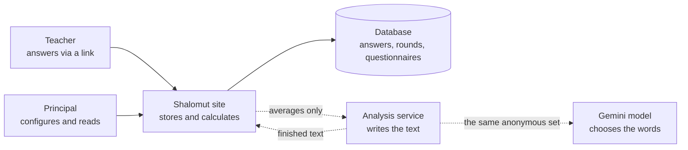
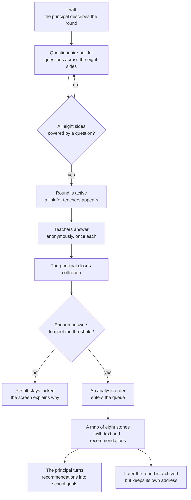
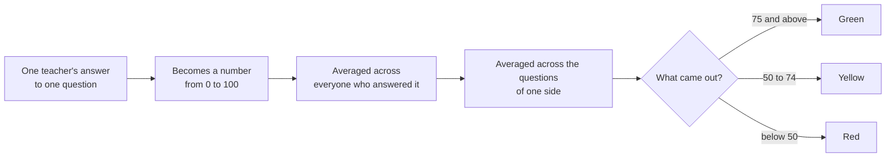
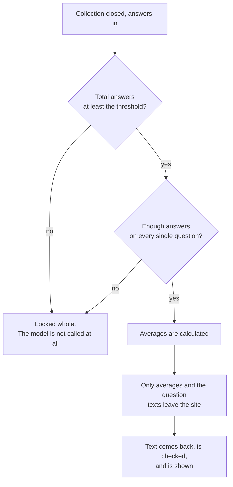
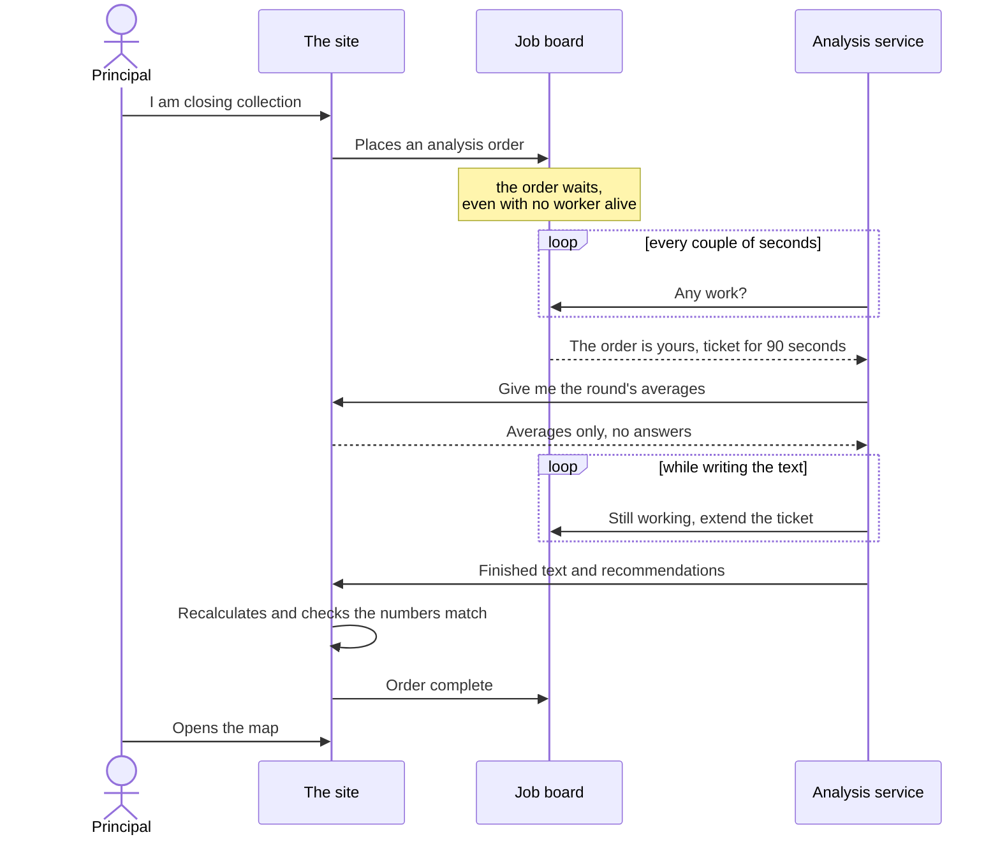

# How the platform works, in plain language

Living document, and the **source text** for every translated snapshot of it.
Written for someone who has to understand what the product does without reading
the code: a school partner, a methodologist, a new team member, an owner
deciding what to build next.

Two rules govern this file.

- **Plain language is the point, not a style preference.** Its readers do not
  know what a lease, a contract version or a durable job is, and do not need to.
  Where a mechanism has a technical name, the name is in the glossary at the end
  so the reader can say it to a developer — not in the body.
- **This file is the original; `snapshots/` holds translations.** A change
  belongs here first. See [`snapshots/README.md`](snapshots/README.md) for how a
  translated copy is released and why it is dated rather than synchronised.

Where this text and the product disagree, the product is right and this text is
what gets fixed. Deeper detail lives in the documents this one links to;
architecture decisions live in [`../PROJECT_CONTEXT.md`](../PROJECT_CONTEXT.md),
and the mechanics of one analysis run are drawn in
[`ai-analysis-run-lifecycle.md`](ai-analysis-run-lifecycle.md).

## 1. What the product does

A school wants to understand how its teaching staff is doing. Not as one
satisfaction number, but across several sides of working life at once. Teachers
answer a questionnaire anonymously, and the principal receives not a table but a
**map of eight stones** — one per side of wellbeing. Each stone carries a colour,
and beside it sits text: what this means, and what to do about it.

The stone metaphor is deliberate. Wellbeing is not a rigid score but something
that shifts and settles differently; stones lie unevenly and look alive, where a
grid of cards looks like a report.

### The eight sides

| Side | Hebrew | What it is about |
| --- | --- | --- |
| Self-expression | ביטוי עצמי | room to be yourself and speak in your own voice |
| Professional competence | מסוגלות מקצועית | the sense of being able to do what is asked |
| Social resources | קשרים חברתיים | relationships with colleagues, having your people nearby |
| Balance | איזון | how work sits against the rest of life |
| Management support | עורף מקצועי | backing from school leadership |
| Certainty | ודאות | how clear the rules, the plans and tomorrow are |
| Organizational climate | אקלים ארגוני | the atmosphere in the school |
| Meaning | משמעות | the sense that the work matters |

The eight are fixed. A school may write its own questions, but not its own
dimensions — see §4.

### The three colours

| Colour | Score | How it is presented |
| --- | --- | --- |
| Green | 75 and above | a strength to preserve; actions that maintain it, not improve it |
| Yellow | 50 to 74 | an area that needs attention |
| Red | below 50 | an area that needs care — never named as a failure |

Green behaving differently from the other two is a product decision, not a
wording choice: a green dimension leads to `פעולות לשימור`, maintenance actions,
rather than to improvement goals.

**Colour is never the only carrier of meaning.** Every colour is accompanied by
a status in words, so a reader who does not distinguish colours, or is looking at
a phone in sunlight, loses nothing.

## 2. Who takes part

Two kinds of people, four machines. The split between the machines is not a
technical preference: it is what makes the promise of anonymity keepable.

Dotted arrows are the boundaries that data about an individual does not cross.
Solid ones stay inside the school.

| Who | What they do |
| --- | --- |
| **Teacher** | Opens an anonymous link, answers, leaves. No registration, no name, no e-mail. The system does not know who it was. |
| **Principal or wellbeing coordinator** | Creates a round, assembles the questionnaire, shares the link, closes collection, reads the map, turns recommendations into school goals. |
| **The site** | The main part. Stores everything, calculates everything, decides what may be shown, renders the screens. The only party that sees answers. |
| **The analysis service** | A separate program with its own life. Receives averages only and returns Hebrew text. Never sees an answer. |

**Why analysis is a separate service.** If the text were written inside the
site, one program would hold both individual answers and a connection to an
external model. Separating them makes a leak not a matter of care but a
structural impossibility: the analysis service has nothing to leak, because it
never holds one person's answers.

## 3. The life of one round

A round is one measurement: one questionnaire, one collection period, one
result. A school runs two to four a year and deletes none — past rounds stay as
the history a new one is measured against.

Four rules govern that path.

- **A school has exactly one active round at a time.** Activating a new one
  closes the previous one. Otherwise two live links would circulate in one staff
  room, and nobody — the system included — could say which measurement a
  respondent was answering.
- **Closing collection is what orders the analysis, not each answer.** While a
  round is open the picture is still moving, and analysing an unfinished
  measurement would show the school a result that changes tomorrow. The
  "analyse again" button exists but refuses a round that is not closed: it is a
  second opinion, not the first.
- **One teacher, one answer.** The teacher's browser holds a random label for
  the duration of filling; a repeated submission carrying the same label does not
  create a second questionnaire. The label is tied to neither a person nor a
  device, and is cleared between people at a shared computer.
- **Archiving only removes a round from the list.** An archived round keeps its
  page, its map and its place in comparisons. It can no longer be changed — a
  deliberate point of no return, which is why the product asks for confirmation.

## 4. The questionnaire and its versions

Questions are not baked into the product. Each school may ask its own, in its
own words and its own number. One requirement stands: every scored question must
belong to one of the eight sides, and all eight must be covered by at least one
question. Until that holds, the round stays a draft and issues no link.

The default offered is a set of **24 statements** — three per side, answered on
one three-colour scale. It is a starting point, not an allowlist.

| Kind of question | What it does |
| --- | --- |
| **Scored** | Produces a number, enters the average for its side, and ends up colouring a stone. These are the ones that must cover all eight sides. |
| **Background** | Age, tenure, role, workload. Scores nothing and moves no stone. Exists so the picture can be read by group — and lives under its own, stricter privacy rules (§6). |

**A questionnaire cannot be rewritten mid-collection.** Once the first answer
arrives, this round's questions freeze. The reason is simple: if half the staff
answered one wording and half another, an average over them means nothing.
Changing the questions means starting a new round.

While there are no answers yet, editing is free, and every save files a copy of
the questionnaire into a history. A copy can be loaded back into the editor and
saved as an ordinary edit — so a "revert" here is just another save, which is
itself versioned and therefore reversible. Twenty copies per round are kept: a
recovery line, not an archive.

## 5. How a stone gets its colour

Nothing clever happens here, and that is the point: arithmetic decides the
colour, not a model. The same number always yields the same colour, and the AI
cannot influence it.

The 75 and 50 boundaries live in one settings file that both programs read — the
site and the analysis service. Tuning the methodology after the pilot is
therefore an edit in one place, not a hunt for the number 75 across the code.

One subtlety worth knowing: a question can be reversed. A high answer to "I have
enough support" is good; a high answer to "I am constantly behind" is not. The
model of a question can carry that polarity, so 100 always means wellbeing rather
than mere agreement.

## 6. Privacy

Not a setting and not a checkbox, but a property of the product: the thing that
cannot be switched off without breaking what it is for. Teachers answer honestly
exactly as far as they believe their answer cannot be pulled back out.

### The threshold of ten

Below ten answers the result is locked whole. Not shown approximately, not shown
without detail — locked, and the screen says why. Ten is both the default and the
minimum: a principal may raise the threshold for their school, never lower it.

Note the second check: **all or nothing**. If even one question is short of
answers, the whole detailed result closes rather than that one question. Quietly
dropping the inconvenient question and showing the rest would be more
convenient — and would be a way to recover the missing answers by subtraction.

### What leaves the school

| Leaves | Never leaves |
| --- | --- |
| Average scores for the eight sides | Any individual's answers |
| Per-question averages and answer counts | Names, e-mails, addresses — absent from the schema, not merely unused |
| The text of the questions themselves | The filling-session label |
| The principal's own notes about the school, if written | Any background answer: age, tenure, role, salary band |

Demographics do not reach the model at all. The map's reader does not need them,
and an external service would then hold a profile of a named school's staff.

### A separate guarantee for group breakdowns

The threshold of ten protects a *total* and says nothing about a single *cell* of
a table. "Teachers aged 51–60 in the special-needs track" can be one person
inside a perfectly healthy round of eighty. Group tables therefore carry their
own rule:

- no cell below the threshold is published;
- no suppressed cell can be recovered by subtraction — every row and every column
  either holds no suppressed cells at all or at least two, because one blank
  beside a published total is a subtraction, not a blank;
- the grand total stays published: it is the round's answer count, which every
  manager screen already shows.

### Why answers are never excluded

The temptation is understandable: drop the people who filled the questionnaire in
ninety seconds. The product refuses, and not out of squeamishness. The moment one
round has two different bases — "everyone" and "everyone except a few" — the
difference between the two published pictures *is* those people's answers,
recoverable by subtraction almost exactly.

So a round always has exactly one basis of calculation. The principal does see
*how* the round was filled — how many questionnaires came back faster than the
instrument can be read — and may act at the level of the round: extend
collection, reword the invitation, ask the staff room again. There is no button
that removes a respondent, and there will not be one. The full argument, including
why an unbiased selection criterion would leak exactly as much as a biased one,
is ADR-022 in [`../PROJECT_CONTEXT.md`](../PROJECT_CONTEXT.md).

## 7. How an analysis is ordered

Analysing one round is several minutes of work and roughly thirty calls to a
language model. Anything can happen in that time: the service is restarted, it
falls asleep, the network blinks. So the order is not handed from one party to
another — it is **placed on a job board** and lives in the database until
somebody completes it.

**What the ticket is for.** A ticket is a temporary right to one order, lasting
ninety seconds. While the worker is alive it says so every half minute and the
ticket is extended. If it goes quiet — asleep, crashed, restarted — the ticket
simply expires and the order becomes free again. Nobody has to notice a worker's
death and repair anything by hand: silence is the signal.

The other half of the same mechanism: a worker that wakes up to find its ticket
taken **has no right to write the result**. It learns this at its next attempt to
extend the ticket, at most half a minute later, and stops quietly. Two copies of
one analysis never compete for one map.

- **One school, one order in flight.** A double click or two simultaneous
  requests collapse into a single order rather than two bills from the model.
- **Three attempts, then stop.** An order handed out three times and never
  completed is marked failed and left as it is. There is no endless automatic
  retry: each attempt costs roughly thirty model calls, and failures of this kind
  do not pass by repeating them.
- **A failed order is kept, not cleared.** It is the evidence of what happened.
  Asking again is a deliberate act by the principal.

The same mechanics with real endpoint names, status codes and constants are in
[`ai-analysis-run-lifecycle.md`](ai-analysis-run-lifecycle.md).

## 8. What the AI writes

The division of labour is strict: **the site calculates numbers and colours, the
model writes words**. The model cannot change a score, recolour a stone or move a
boundary. It receives an already-calculated picture and explains it in Hebrew.

What happens inside one analysis:

1. **Privacy check.** First, before a single call to the model. If the round is
   locked by threshold, work ends here and no paid request is spent.
2. **Interpretation.** For each of the eight sides, connected text: what this
   state means in this school.
3. **Choosing recommendations.** Taken not from the model's head but from a
   catalog of interventions written by people, scoped strictly to the side.
4. **Adapting the wording.** The chosen recommendation is rewritten for this
   round so it does not read like an extract from a manual.
5. **Safety validation.** What was written is checked: the right language, no
   causes asserted that the numbers do not support, no claims about people.
   Parts that fail are rewritten — up to three times, and only the rejected parts
   are replayed, not the whole round.

### Honesty where the text is not the model's

Sometimes the model does not answer, or answers in a way validation will not
pass. Rather than a blank, text assembled by the program itself may appear — it
restates the status and the distribution of answers and names no cause at all.
And the screen says in Hebrew that those paragraphs were not written by the AI.

This rule has no exceptions: text the service wrote may be shown, but may not be
presented as the model's. Even the case where a side's overview is the model's
while the short lines under each question are not is disclosed separately, on the
screen that carries them.

If repair fails entirely, the product would rather show an **honest gap** in one
or two sides than lose the round: the school still receives the other six or
seven, with an explanation standing where the missing ones would be. But if
nothing was written at all, or the overall conclusion is missing, the round fails
as a whole — a map with nothing written in it is a failure wearing the shape of a
map.

### What the principal does with recommendations

A recommendation can be turned into a **school goal** and moved through selected
→ in progress → done. A goal is a *copy* of the text at the moment of the
decision, not a reference to it. So the next analysis, rewriting every
recommendation, does not erase a decision the school already made: the goal stays
on screen, marked as chosen from an earlier analysis.

A goal has no owner, no due date and no plan of steps — deliberately, because
those would turn measurement into task management. And no number is shown beside
a goal: a stone's change is not that goal's result, and placing the two together
would assert through layout the causal link the AI is forbidden to assert in
words.

## 9. When something breaks

The governing principle: **a failure announces itself rather than impersonating a
result**. A principal never sees invented text standing in for a model that did
not answer.

| What happened | What the principal sees | What happens inside |
| --- | --- | --- |
| Model unavailable or quota exhausted | A Hebrew sentence: analysis is unavailable right now, try again in a few minutes | The order is marked failed with the precise reason; raw provider errors never reach the screen |
| The analysis service slept or restarted | Nothing — the map simply arrives later | The ticket expires, the order returns to the queue, the next worker takes it |
| Returned text does not match the numbers | No analysis appears; "analyse again" is available | The site recalculates the figures and compares; a mismatch is rejected whole |
| The reply was lost in transit | Nothing — the result is saved | Delivery is retried up to four times; the same result arriving twice is recognised as the same one, not as a second write |
| Not enough answers | The screen explains the result is locked for anonymity | No order is created at all and the model is never called |

One thing worth remembering: **the system never retries by itself**. If an
analysis failed, no background mechanism will loop over it. A person asks again —
which is also a protection, because every attempt costs money and because the
causes of most such failures do not change on repetition.

## 10. Where all this lives

There are exactly two environments and no third: **local**, on a developer's
machine, and **deployed**, the one reachable by link. The deployed one is called
production out of habit, but holds no real respondents and no real data yet: this
is the design stage, and the contents of the database are treated as disposable.

| Party | What it does | Where physically |
| --- | --- | --- |
| Vercel | hosts the site; every request passes through it | default region, never chosen |
| Supabase | the database: rounds, questionnaires, answers, results | Seoul |
| Render | hosts the analysis service | Frankfurt |
| Google | the language model that writes the text | region not selected |

**Israel is not in that column.** The school and the teachers are in Israel; the
four parties sit in at least three other jurisdictions. This is known and
recorded — the Seoul database is the most visible part, and one query to it costs
noticeably more time than it would to a nearer neighbour. It has to be revisited
before the first real respondents, together with replacing the design-stage
credentials. The full account of who receives what is
[`data-flow-and-subprocessors.md`](data-flow-and-subprocessors.md).

One more property of the deployed environment worth knowing in advance: the
analysis service runs on a free plan and falls asleep without inbound traffic. A
sleeping service is not a slow service — it is one that takes no orders off the
board at all, because its own polling is outbound and does not count. So it is
woken from outside: an external free monitor knocks on its health address every
five minutes.

## 11. Rules that do not bend

The short list of what may not be worked around, for convenience or for a nicer
screen. If one of these stops holding, that is not a small bug — it is the
product broken.

1. **Nothing detailed is shown below the threshold.** Not to the manager, not to
   the model, not in a group breakdown.
2. **An individual answer and an identity never leave the site.** Only averages
   go out.
3. **The eight sides and the colour boundaries belong to the site.** The model
   neither chooses nor can change them.
4. **Text written by the program is never presented as the model's.**
5. **Empty persistence stays empty.** With no data the product says there is
   nothing here yet, rather than showing a demo school with invented numbers.
6. **A round has one basis of calculation.** No "the same thing again, but
   without these answers".
7. **Hebrew and right-to-left are the product's native reality**, not a
   translation bolted on afterwards.

## 12. Glossary

Left: how this handbook says it. Right: what a developer calls it.

| In plain language | In the code and in conversation |
| --- | --- |
| The site | Core, the Next.js application |
| The analysis service | AI analytics service, FastAPI |
| A side of wellbeing, a stone | dimension, stone |
| A measurement | round |
| The job board, an analysis order | the durable job queue, `AiAnalysisRun` |
| A ticket for 90 seconds | lease, and its `leaseToken` |
| "Still working" | heartbeat, every 30 seconds |
| The threshold of ten | `privacyThreshold` |
| The result is locked for anonymity | privacy locked |
| Averages without personal data | privacy-safe aggregates |
| The agreed exchange format | contract, versions `1.0`–`6.0` |
| Text written by the program, not the model | `deterministic_fallback` |
| An honest gap instead of text | `outcome: unavailable`, partial map |
| The frozen questionnaire of a round | `surveyDefinition`, the question snapshot |
| The filling-session label | `anonymousTokenHash` |
| Hiding small cells in group tables | cell suppression |
