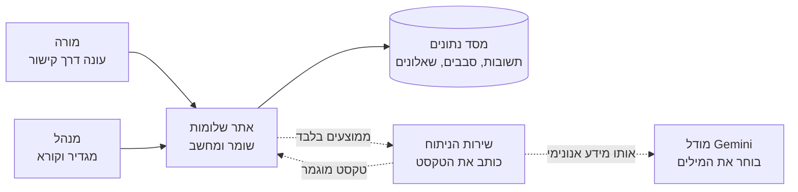
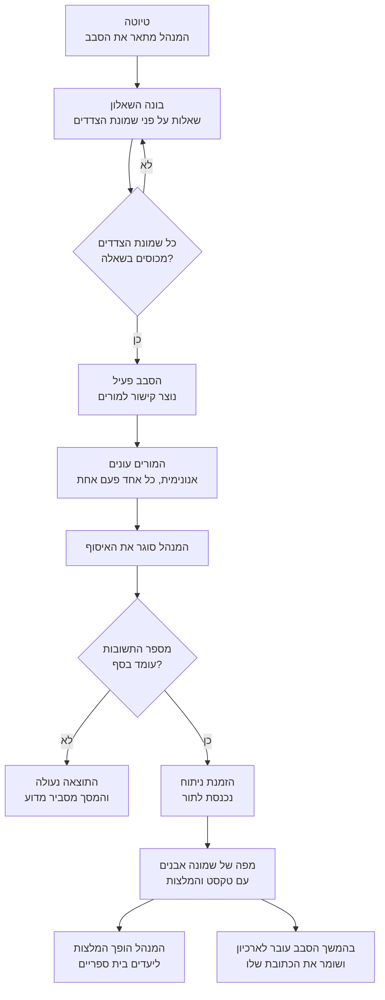
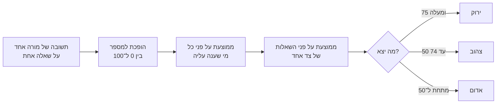
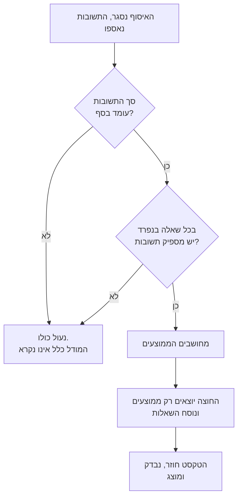
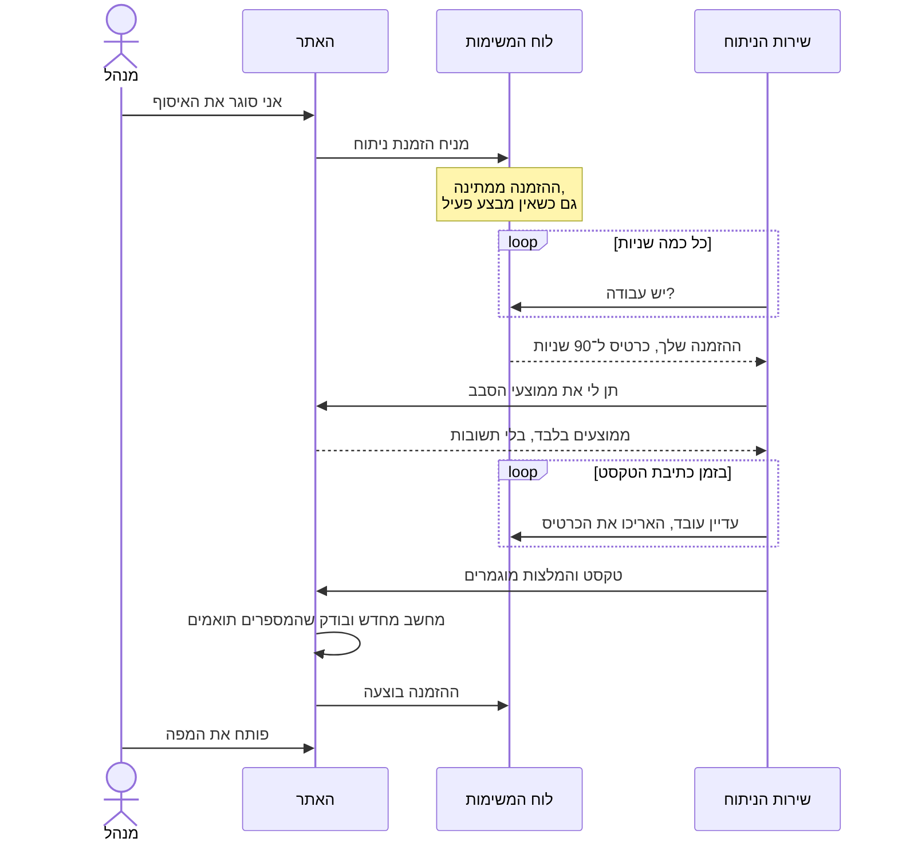

# איך מפת שלומות עובדת

> **תצלום, לא מסמך חי.** תרגום של
> [`../platform-handbook.md`](../platform-handbook.md), שיצא ב־2026-08-18 מן
> הגרסה שנוספה באותו commit. תיקונים נכתבים במקור ומשם מוצאים מחדש; כלל ההוצאה
> נמצא ב־[`README.md`](README.md). אם הטקסט הזה סותר את המקור — המקור צודק.

הסבר על מנגנון המוצר במילים רגילות, למי שצריך להבין מה המוצר עושה בלי לקרוא קוד:
שותפה מצד בית הספר, מתודולוג, אדם חדש בצוות, או הבעלים שמחליט מה לבנות הלאה.

היכן שלמנגנון יש שם טכני, השם מופיע במילון שבסוף — כדי שאפשר יהיה לומר אותו
למפתח, ולא כדי לקרוא אותו כאן.

## 1. מה המוצר עושה

בית ספר רוצה להבין איך מרגיש הצוות החינוכי שלו. לא כמספר שביעות רצון אחד, אלא
בכמה צדדים של חיי העבודה בבת אחת. המורים עונים על שאלון באופן אנונימי, והמנהל
מקבל לא טבלה אלא **מפה של שמונה אבנים** — אחת לכל צד של שלומות. לכל אבן יש צבע,
ולצידה טקסט: מה זה אומר ומה עושים עם זה.

מטאפורת האבנים מכוונת. שלומות אינה ציון נוקשה אלא דבר שזז ומתיישב מחדש; אבנים
מונחות במפוזר ונראות חיות, ורשת של כרטיסים נראית כמו דוח.

### שמונת הצדדים

| צד | מזהה באנגלית | על מה מדובר |
| --- | --- | --- |
| ביטוי עצמי | self-expression | מרחב להיות עצמך ולדבר בקול שלך |
| מסוגלות מקצועית | professional-competence | התחושה שאני יודע לעשות את מה שמבקשים ממני |
| קשרים חברתיים | social-resource | יחסים עם עמיתים, תחושה שיש אנשים שלך לידך |
| איזון | balance | היחס בין העבודה לשאר החיים |
| עורף מקצועי | management-support | הגיבוי מצד הנהלת בית הספר |
| ודאות | certainty | כמה ברורים הכללים, התוכניות והמחר |
| אקלים ארגוני | organizational-climate | האווירה בבית הספר |
| משמעות | meaning | התחושה שלעבודה יש ערך |

שמונת הצדדים קבועים. בית ספר רשאי לכתוב שאלות משלו, אך לא ממדים משלו — ראו §4.

### שלושת הצבעים

| צבע | ניקוד | איך זה מוצג |
| --- | --- | --- |
| ירוק | 75 ומעלה | חוזקה לשימור; פעולות לשימור ולא יעדי שיפור |
| צהוב | 50 עד 74 | תחום שדורש תשומת לב |
| אדום | מתחת ל־50 | תחום שזקוק לטיפול — ואף פעם לא מוצג ככישלון |

העובדה שהירוק מתנהג אחרת היא החלטת מוצר ולא בחירת ניסוח: ממד ירוק מוביל ל־`פעולות
לשימור` ולא ליעדי שיפור.

**הצבע לעולם אינו נושא המשמעות היחיד.** לצד כל צבע מופיע סטטוס במילים, כך שקורא
שאינו מבחין בצבעים, או שמסתכל על טלפון בשמש, אינו מפסיד דבר.

## 2. מי משתתף

שני סוגי אנשים, ארבע מכונות. ההפרדה בין המכונות אינה גחמה טכנית: היא מה שהופך את
הבטחת האנונימיות לניתנת לקיום.

חצים מקווקוים הם הגבולות שמידע על אדם מסוים אינו חוצה. החצים המלאים נשארים בתוך
בית הספר.

| מי | מה עושה |
| --- | --- |
| **מורה** | פותח קישור אנונימי, עונה והולך. בלי הרשמה, בלי שם, בלי דוא״ל. המערכת אינה יודעת מי זה היה. |
| **מנהל או רכזת שלומות** | פותח סבב, מרכיב שאלון, מפיץ קישור, סוגר את האיסוף, קורא את המפה והופך המלצות ליעדים בית ספריים. |
| **האתר** | החלק המרכזי. שומר הכול, מחשב הכול, מחליט מה מותר להציג ומצייר את המסכים. הגורם היחיד שרואה תשובות. |
| **שירות הניתוח** | תוכנית נפרדת בעלת חיים משלה. מקבל ממוצעים בלבד ומחזיר טקסט בעברית. לעולם אינו רואה תשובה. |

**למה הניתוח הופרד.** אילו הטקסט נכתב בתוך האתר, לתוכנית אחת הייתה גישה גם
לתשובות של אנשים מסוימים וגם למודל חיצוני. ההפרדה הופכת דליפה מעניין של זהירות
לבלתי אפשרית מבנית: לשירות הניתוח אין מה להדליף, מפני שאין ברשותו תשובות של אדם
אחד.

## 3. חייו של סבב אחד

סבב הוא מדידה אחת: שאלון אחד, תקופת איסוף אחת, תוצאה אחת. בית ספר עורך שניים עד
ארבעה סבבים בשנה ואינו מוחק אף אחד: הסבבים הקודמים נשארים ההיסטוריה שמולה נמדד
החדש.

ארבעה כללים חלים על המסלול הזה.

- **לבית ספר יש בדיוק סבב פעיל אחד בכל רגע.** הפעלת סבב חדש סוגרת את הקודם. אחרת
  היו מסתובבים בחדר מורים אחד שני קישורים חיים, ואיש — כולל המערכת — לא היה יכול
  לומר על איזו מדידה המשיב עונה.
- **סגירת האיסוף היא מה שמזמין את הניתוח, לא כל תשובה.** כל עוד הסבב פתוח התמונה
  עדיין זזה, וניתוח של מדידה שלא הסתיימה היה מציג לבית הספר תוצאה שתשתנה מחר.
  כפתור "לנתח שוב" קיים אך מסרב לסבב שאינו סגור: הוא דעה שנייה, לא הראשונה.
- **מורה אחד, תשובה אחת.** הדפדפן של המורה מחזיק תווית אקראית למשך המילוי; שליחה
  חוזרת עם אותה תווית אינה יוצרת שאלון שני. התווית אינה קשורה לא לאדם ולא למכשיר,
  ונמחקת בין אנשים במחשב משותף.
- **העברה לארכיון רק מוציאה סבב מהרשימה.** סבב בארכיון שומר את הדף שלו, את המפה
  שלו ואת מקומו בהשוואות. לשנות אותו כבר אי אפשר — נקודת אל־חזור מכוונת, ולכן
  המוצר מבקש אישור.

## 4. השאלון והגרסאות שלו

השאלות אינן קבועות בתוך המוצר. כל בית ספר רשאי לשאול את שלו, בניסוח שלו ובכמות
שלו. דרישה אחת עומדת: כל שאלה מנוקדת חייבת להשתייך לאחד משמונת הצדדים, וכל שמונת
הצדדים חייבים להיות מכוסים בשאלה אחת לפחות. עד שזה מתקיים הסבב נשאר טיוטה ואינו
מנפיק קישור.

ברירת המחדל המוצעת היא מערך של **24 היגדים** — שלושה לכל צד, בסולם תלת־צבעי אחד.
זו נקודת מוצא ולא רשימה סגורה.

| סוג שאלה | מה היא עושה |
| --- | --- |
| **מנוקדת** | מייצרת מספר, נכנסת לממוצע של הצד שלה ובסופו של דבר צובעת אבן. אלה השאלות שחייבות לכסות את כל שמונת הצדדים. |
| **רקע** | גיל, ותק, תפקיד, היקף משרה. אינה מנקדת ואינה מזיזה אף אבן. קיימת כדי לקרוא את התמונה לפי קבוצות — וחיה תחת כללי פרטיות נפרדים ומחמירים יותר (§6). |

**אי אפשר לשכתב שאלון באמצע האיסוף.** ברגע שהתשובה הראשונה מגיעה, שאלות הסבב
קופאות. הסיבה פשוטה: אם מחצית מהצוות ענתה על ניסוח אחד ומחצית על אחר, ממוצע
עליהם אינו אומר דבר. שינוי השאלות פירושו פתיחת סבב חדש.

כל עוד אין תשובות, העריכה חופשית, וכל שמירה מתייקת עותק של השאלון להיסטוריה. אפשר
לטעון עותק בחזרה לעורך ולשמור אותו כעריכה רגילה — כלומר "שחזור" כאן הוא פשוט שמירה
נוספת, שגם היא נשמרת בהיסטוריה ולכן הפיכה. נשמרים עשרים עותקים לסבב: גלגל הצלה,
לא ארכיון.

## 5. איך אבן מקבלת את צבעה

שום דבר חכם אינו קורה כאן, וזו הנקודה: החשבון קובע את הצבע, לא המודל. אותו מספר
תמיד נותן אותו צבע, ולבינה המלאכותית אין השפעה על כך.

הגבולות 75 ו־50 יושבים בקובץ הגדרות אחד שקוראות שתי התוכניות — האתר ושירות
הניתוח. לכן כיוונון המתודולוגיה אחרי הפיילוט הוא עריכה במקום אחד, ולא ציד אחרי
המספר 75 בכל הקוד.

דקות אחת שכדאי להכיר: שאלה יכולה להיות הפוכה. תשובה גבוהה על "יש לי מספיק גיבוי"
היא טובה; תשובה גבוהה על "אני כל הזמן לא מספיק" אינה טובה. מודל השאלה יודע לשאת
את הקוטביות הזאת, כך ש־100 תמיד יסמן שלומות ולא סתם הסכמה.

## 6. פרטיות

לא הגדרה ולא תיבת סימון, אלא תכונה של המוצר: הדבר שאי אפשר לכבות בלי לשבור את
ייעודו. מורים עונים בכנות בדיוק במידה שבה הם מאמינים שאי אפשר לשלוף את תשובתם
בחזרה.

### סף של עשרה

מתחת לעשר תשובות התוצאה נעולה כולה. לא מוצגת בקירוב, לא מוצגת בלי פירוט — נעולה,
והמסך אומר מדוע. עשר הוא גם ברירת המחדל וגם המינימום: מנהל רשאי להעלות את הסף
לבית ספרו, ולעולם לא להוריד אותו.

שימו לב לבדיקה השנייה: **הכול או כלום**. אם אפילו בשאלה אחת חסרות תשובות, כל
התוצאה המפורטת נסגרת ולא רק אותה שאלה. להשמיט בשקט את השאלה הלא נוחה ולהציג את
השאר היה נוח יותר — והיה דרך לשחזר את התשובות החסרות בחיסור.

### מה יוצא מחוץ לבית הספר

| יוצא | לעולם אינו יוצא |
| --- | --- |
| ציוני ממוצע לשמונת הצדדים | תשובותיו של אדם מסוים |
| ממוצע לכל שאלה ומספר המשיבים | שמות, כתובות דוא״ל, כתובות — אינם קיימים בסכימה, ולא רק שאינם בשימוש |
| נוסח השאלות עצמן | תווית מפגש המילוי |
| הערות המנהל על בית הספר, אם נכתבו | כל תשובת רקע: גיל, ותק, תפקיד, טווח שכר |

הדמוגרפיה אינה מגיעה למודל כלל. קורא המפה אינו זקוק לה, ושירות חיצוני היה מחזיק
אז פרופיל של צוות בית ספר מזוהה.

### הגנה נפרדת לפילוחים לפי קבוצות

הסף של עשרה מגן על *סך הכול* ואינו אומר דבר על *תא* בודד בטבלה. "מורים בני 51–60
במסלול החינוך המיוחד" יכול להיות אדם אחד בתוך סבב בריא לגמרי של שמונים. לכן
לטבלאות הקבוצתיות יש כלל משלהן:

- תא מתחת לסף אינו מפורסם;
- אי אפשר לשחזר תא מוסתר בחיסור — בכל שורה ובכל עמודה אין תאים מוסתרים כלל, או
  שיש לפחות שניים, מפני שמקום ריק אחד לצד סכום מפורסם הוא חיסור ולא מקום ריק;
- הסכום הכולל נשאר מפורסם: זהו מספר המשיבים בסבב, שכל מסך ניהולי ממילא מציג.

### מדוע תשובות לעולם אינן מוחרגות

הפיתוי מובן: להשמיט את מי שמילא את השאלון בתשעים שניות. המוצר מסרב, ולא מתוך
קפדנות אסתטית. ברגע שלסבב אחד יש שני בסיסי חישוב — "כולם" ו"כולם חוץ מכמה" —
ההפרש בין שתי התמונות המפורסמות *הוא* התשובות של אותם אנשים, הניתנות לשחזור
בחיסור כמעט במדויק.

לכן לסבב יש תמיד בסיס חישוב אחד בלבד. המנהל אכן רואה *איך* מולא הסבב — כמה שאלונים
חזרו מהר יותר מכפי שאפשר בכלל לקרוא את הכלי — ורשאי לפעול ברמת הסבב: להאריך את
האיסוף, לנסח מחדש את ההזמנה, לבקש שוב מחדר המורים. אין כפתור שמסיר משיב, ולא יהיה
כזה. הנימוק המלא, לרבות מדוע קריטריון בחירה לא־מוטה היה מדליף בדיוק כמו מוטה, הוא
ADR-022 ב־[`../../PROJECT_CONTEXT.md`](../../PROJECT_CONTEXT.md).

## 7. איך מזמינים ניתוח

ניתוח של סבב אחד הוא כמה דקות עבודה וכשלושים פניות למודל שפה. בזמן הזה הכול יכול
לקרות: השירות מופעל מחדש, נרדם, הרשת מהבהבת. לכן ההזמנה אינה עוברת מיד ליד אלא
**מונחת על לוח משימות** וחיה במסד הנתונים עד שמישהו מבצע אותה.

**למה נועד הכרטיס.** הכרטיס הוא זכות זמנית להזמנה אחת, למשך תשעים שניות. כל עוד
המבצע חי הוא מאשר זאת כל חצי דקה והכרטיס מוארך. אם השתתק — נרדם, קרס, הופעל
מחדש — הכרטיס פשוט פג, וההזמנה משתחררת. איש אינו צריך להבחין במותו של המבצע ולתקן
משהו ידנית: השתיקה היא האות.

הצד השני של אותו מנגנון: מבצע שמתעורר ומגלה שהכרטיס שלו נלקח **אינו רשאי לכתוב את
התוצאה**. הוא לומד זאת בניסיון הבא להאריך את הכרטיס, לכל היותר כעבור חצי דקה,
ונעצר בשקט. שני עותקים של אותו ניתוח לעולם אינם מתחרים על מפה אחת.

- **בית ספר אחד, הזמנה אחת בעבודה.** לחיצה כפולה או שתי בקשות במקביל מתמזגות
  להזמנה אחת ולא לשני חיובים מהמודל.
- **שלושה ניסיונות, ודי.** הזמנה שנמסרה שלוש פעמים ולא הושלמה מסומנת ככושלת
  ונשארת כך. אין חזרה אוטומטית אינסופית: כל ניסיון עולה כשלושים פניות למודל,
  וכשלים מסוג זה אינם חולפים בחזרה עליהם.
- **הזמנה כושלת נשמרת ולא נמחקת.** היא־היא העדות למה שקרה. לבקש שוב זו פעולה
  מודעת של המנהל.

אותו מנגנון בדיוק, עם שמות נקודות הקצה, קודי התגובה והקבועים, נמצא ב־
[`../ai-analysis-run-lifecycle.md`](../ai-analysis-run-lifecycle.md).

## 8. מה הבינה המלאכותית כותבת

חלוקת העבודה נוקשה: **האתר מחשב מספרים וצבעים, המודל כותב מילים**. המודל אינו יכול
לשנות ציון, לצבוע אבן מחדש או להזיז גבול. הוא מקבל תמונה מחושבת ומסביר אותה
בעברית.

מה קורה בתוך ניתוח אחד:

1. **בדיקת פרטיות.** ראשונה, לפני פנייה אחת למודל. אם הסבב נעול בגלל הסף, העבודה
   נגמרת כאן ואף בקשה בתשלום אינה מוצאת.
2. **פרשנות.** לכל אחד משמונת הצדדים נכתב טקסט מחובר: מה המצב הזה אומר בבית הספר
   הזה.
3. **בחירת המלצות.** נלקחות לא מראשו של המודל אלא מקטלוג התערבויות שכתבו אנשים,
   בהתאמה קפדנית לצד המדובר.
4. **התאמת הניסוח.** ההמלצה הנבחרת נכתבת מחדש עבור הסבב הזה, כדי שלא תישמע כציטוט
   ממדריך.
5. **בדיקת בטיחות.** מה שנכתב נבדק: האם זו השפה הנכונה, האם לא נטענו סיבות
   שהמספרים אינם תומכים בהן, האם לא נאמר דבר על אנשים. חלקים שנפסלו נכתבים מחדש —
   עד שלוש פעמים, ורק החלקים שנפסלו, לא הסבב כולו.

### כנות היכן שהטקסט אינו של המודל

לפעמים המודל אינו עונה, או עונה באופן שהבדיקה אינה מאשרת. אז במקום ריק עשוי
להופיע טקסט שהתוכנית עצמה הרכיבה: הוא חוזר על הסטטוס ועל התפלגות התשובות ואינו
נוקב בסיבה כלשהי. והמסך אומר בעברית שהפסקאות האלה לא נכתבו על ידי הבינה המלאכותית.

לכלל הזה אין יוצא מן הכלל: טקסט שהשירות כתב מותר להציג, אך אסור להציג כטקסט של
המודל. גם המקרה שבו סקירת הצד היא של המודל בעוד השורות הקצרות שמתחת לכל שאלה אינן
כזאת — מגולה בנפרד, במסך שנושא אותן.

אם התיקון נכשל לגמרי, המוצר יעדיף להראות **פער כן** בצד אחד או שניים מאשר לאבד את
הסבב: בית הספר עדיין מקבל את ששת או שבעת הצדדים האחרים, ובמקום החסרים עומד הסבר.
אבל אם לא נכתב דבר, או שהמסקנה הכוללת חסרה — הסבב נכשל בשלמותו: מפה שלא נכתב בה
דבר היא כישלון בצורת מפה.

### מה המנהל עושה עם ההמלצות

אפשר להפוך המלצה ל**יעד בית ספרי** ולהוביל אותה דרך "נבחר" ← "בעבודה" ← "בוצע".
היעד הוא *עותק* של הטקסט ברגע ההחלטה, ולא הפניה אליו. לכן הניתוח הבא, שמשכתב את כל
ההמלצות, אינו מוחק החלטה שבית הספר כבר קיבל: היעד נשאר על המסך עם ציון שהוא נבחר
מתוך ניתוח מוקדם יותר.

ליעד אין אחראי, אין תאריך יעד ואין תוכנית צעדים — במכוון, מפני שאלה היו הופכים
מדידה לניהול משימות. וגם לא מוצג מספר לצד יעד: השינוי באבן אינו התוצאה של אותו
יעד, והצבתם זה לצד זה הייתה טוענת בעיצוב את הקשר הסיבתי שאסור לבינה המלאכותית
לטעון במילים.

## 9. כשמשהו נשבר

העיקרון המנחה: **תקלה מכריזה על עצמה ואינה מתחזה לתוצאה**. מנהל לעולם אינו רואה
טקסט מומצא במקום מודל שלא ענה.

| מה קרה | מה המנהל רואה | מה קורה מבפנים |
| --- | --- | --- |
| המודל אינו זמין או שהמכסה נוצלה | משפט בעברית: הניתוח אינו זמין כרגע, נסו שוב בעוד כמה דקות | ההזמנה מסומנת ככושלת עם הסיבה המדויקת; שגיאות ספק גולמיות אינן מגיעות למסך |
| שירות הניתוח נרדם או הופעל מחדש | כלום — המפה פשוט מגיעה מאוחר יותר | הכרטיס פג, ההזמנה חוזרת לתור, והמבצע הבא לוקח אותה |
| הטקסט שהוחזר אינו תואם למספרים | ניתוח אינו מופיע; הכפתור "לנתח שוב" זמין | האתר מחשב מחדש את הנתונים ומשווה; אי־התאמה נדחית בשלמותה |
| התשובה אבדה בדרך | כלום — התוצאה נשמרת | המסירה חוזרת עד ארבע פעמים; אותה תוצאה שמגיעה פעמיים מזוהה כאותה אחת ולא ככתיבה שנייה |
| לא היו מספיק תשובות | המסך מסביר שהתוצאה נעולה למען האנונימיות | הזמנה כלל אינה נוצרת והמודל אינו נקרא |

דבר אחד ראוי לזכור: **המערכת לעולם אינה חוזרת מעצמה**. אם ניתוח נכשל, שום מנגנון
רקע לא ילך סביבו במעגל. אדם מבקש שוב — וגם זו הגנה, מפני שכל ניסיון עולה כסף
ומפני שסיבותיהם של רוב הכשלים האלה אינן משתנות בחזרה עליהם.

## 10. איפה כל זה חי

יש בדיוק שתי סביבות ואין שלישית: **מקומית**, על מחשב המפתח, ו**פרוסה**, זו שניתן
להגיע אליה בקישור. את הפרוסה מכנים "פרודקשן" מתוך הרגל, אבל אין בה עדיין משיבים
אמיתיים ולא נתונים אמיתיים: זהו שלב התכנון, ותוכן מסד הנתונים נחשב מתכלה.

| מי | מה עושה | היכן פיזית |
| --- | --- | --- |
| Vercel | מארח את האתר; כל בקשה עוברת דרכו | אזור ברירת מחדל, לא נבחר |
| Supabase | מסד הנתונים: סבבים, שאלונים, תשובות, תוצאות | סיאול |
| Render | מארח את שירות הניתוח | פרנקפורט |
| Google | מודל השפה שכותב את הטקסט | אזור לא נבחר |

**ישראל אינה בטור הזה.** בית הספר והמורים בישראל; ארבעת הגורמים יושבים בשלוש
תחומי שיפוט אחרים לפחות. הדבר ידוע ומתועד: מסד הנתונים בסיאול הוא החלק הבולט
ביותר, ושאילתה אחת אליו עולה זמן ניכר יותר מכפי שהייתה עולה אצל שכן קרוב. יש
לשוב ולבחון זאת לפני המשיבים האמיתיים הראשונים, יחד עם החלפת אישורי שלב התכנון.
הפירוט המלא של מי מקבל מה נמצא ב־
[`../data-flow-and-subprocessors.md`](../data-flow-and-subprocessors.md).

תכונה נוספת של הסביבה הפרוסה שכדאי להכיר מראש: שירות הניתוח חי בתוכנית חינמית
ונרדם ללא תעבורה נכנסת. שירות ישן אינו שירות אטי — הוא שירות שאינו לוקח הזמנות מן
הלוח בכלל, מפני שהתשאול שלו עצמו יוצא ואינו נספר. לכן מעירים אותו מבחוץ: מנטר
חיצוני חינמי דופק על כתובת הבריאות שלו כל חמש דקות.

## 11. כללים שאינם מתכופפים

הרשימה הקצרה של מה שאין לעקוף, לא למען הנוחות ולא למען מסך יפה יותר. אם אחד מהם
חדל להתקיים, זו אינה תקלה קטנה אלא מוצר שבור.

1. **מתחת לסף לא מוצג שום דבר מפורט.** לא למנהל, לא למודל ולא בפילוח לפי קבוצות.
2. **תשובה בודדת וזהות לעולם אינן עוזבות את האתר.** החוצה יוצאים ממוצעים בלבד.
3. **שמונת הצדדים וגבולות הצבעים שייכים לאתר.** המודל אינו בוחר אותם ואינו יכול
   לשנותם.
4. **טקסט שכתבה התוכנית לעולם אינו מוצג כטקסט של המודל.**
5. **אחסון ריק נשאר ריק.** בלי נתונים המוצר אומר שאין כאן עדיין דבר, ואינו מציג
   בית ספר להדגמה עם מספרים מומצאים.
6. **לסבב יש בסיס חישוב אחד.** אין "אותו דבר שוב, אבל בלי התשובות האלה".
7. **עברית וכיוון מימין לשמאל הם המציאות הילידית של המוצר**, לא תרגום שהוברג
   אחר כך.

## 12. מילון

מימין — איך המדריך הזה אומר זאת. משמאל — איך מפתח קורא לזה.

| במילים רגילות | בקוד ובשיחה |
| --- | --- |
| האתר | Core, יישום Next.js |
| שירות הניתוח | AI analytics service, FastAPI |
| צד של שלומות, אבן | dimension, stone |
| מדידה, סבב | round |
| לוח המשימות, הזמנת ניתוח | תור durable jobs, `AiAnalysisRun` |
| כרטיס ל־90 שניות | lease ו־`leaseToken` שלו |
| "עדיין עובד" | heartbeat, כל 30 שניות |
| הסף של עשרה | `privacyThreshold` |
| התוצאה נעולה למען האנונימיות | privacy locked |
| ממוצעים בלי נתונים אישיים | privacy-safe aggregates |
| הסכמה על פורמט ההחלפה | contract, גרסאות `1.0`–`6.0` |
| טקסט שכתבה התוכנית ולא המודל | `deterministic_fallback` |
| פער כן במקום טקסט | `outcome: unavailable`, partial map |
| השאלון הקפוא של הסבב | `surveyDefinition` |
| תווית מפגש המילוי | `anonymousTokenHash` |
| הסתרת תאים קטנים בטבלאות קבוצתיות | cell suppression |
