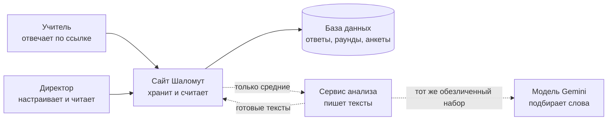
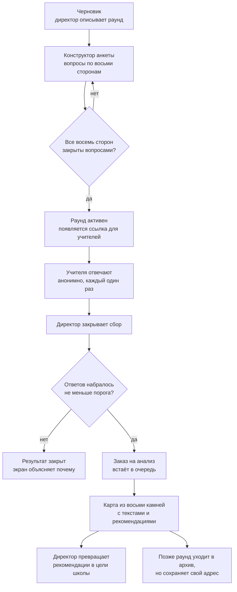
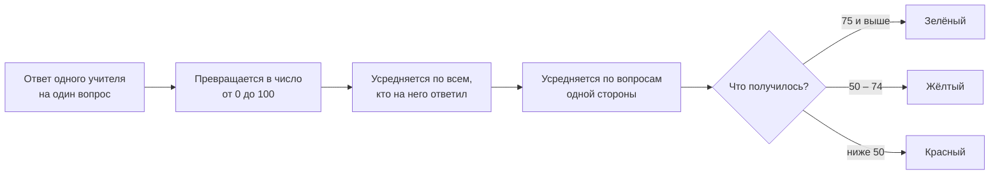
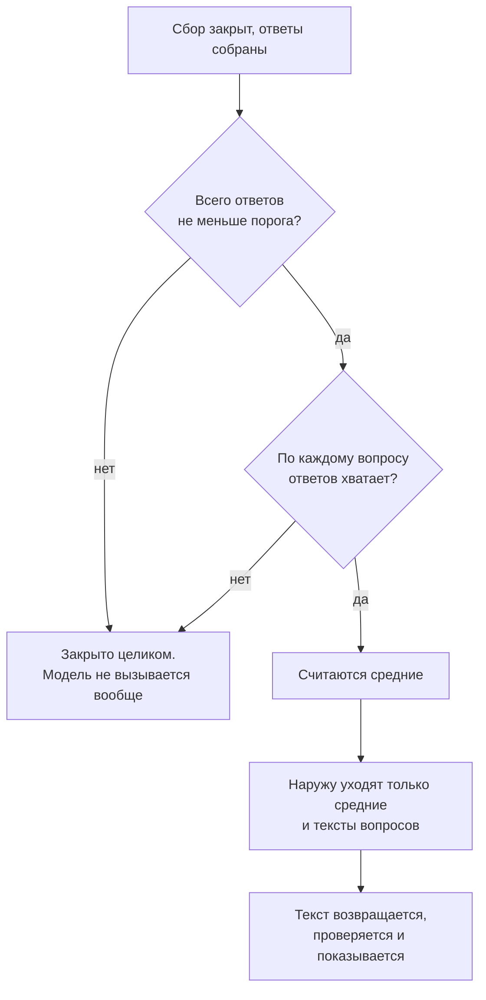
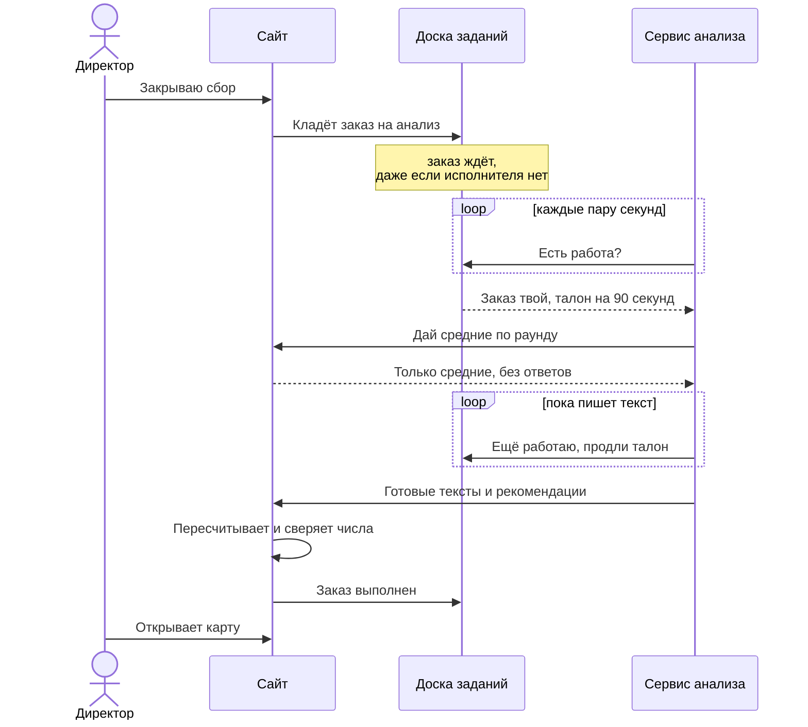

# Как устроена Шаломут

> **Снимок, а не живой документ.** Перевод
> [`../platform-handbook.md`](../platform-handbook.md), выпущенный 2026-08-18 с
> той версии источника, которая добавлена этим же коммитом. Правки вносятся в
> источник и переиздаются сюда; правило выпуска — в
> [`README.md`](README.md). Если этот текст расходится с источником, прав
> источник.

Объяснение механики платформы обычными словами — для тех, кому нужно понимать,
что делает продукт, не читая код: партнёра со стороны школы, методолога, нового
человека в команде, владельца, решающего, что строить дальше.

Где у механизма есть техническое название, оно вынесено в словарик в конце —
чтобы его можно было назвать разработчику, а не чтобы читать его здесь.

## 1. Что делает продукт

Школа хочет понимать, как себя чувствует её педагогический коллектив. Не одним
числом удовлетворённости, а по нескольким сторонам рабочей жизни сразу. Учителя
анонимно отвечают на анкету, а директор получает не таблицу, а **карту из восьми
камней** — по одному на каждую сторону благополучия. Камень окрашен, и рядом с
ним лежит текст: что это значит и что с этим делать.

Метафора камней намеренна. Благополучие — не жёсткая оценка, а нечто, что
смещается и складывается заново; камни лежат неровно и выглядят живыми, а сетка
карточек выглядит отчётом.

### Восемь сторон

| Сторона | На иврите | О чём она |
| --- | --- | --- |
| Самовыражение | ביטוי עצמי | возможность быть собой и говорить своим голосом |
| Профессиональная состоятельность | מסוגלות מקצועית | ощущение «я умею то, что от меня требуется» |
| Социальные связи | קשרים חברתיים | отношения с коллегами, чувство своих людей рядом |
| Баланс | איזון | как работа соотносится с остальной жизнью |
| Профессиональный тыл | עורף מקצועי | поддержка со стороны руководства |
| Определённость | ודאות | понятность правил, планов и завтрашнего дня |
| Организационный климат | אקלים ארגוני | атмосфера в школе |
| Смысл | משמעות | ощущение, что работа имеет значение |

Восемь сторон неизменны. Школа может писать свои вопросы, но не свои
измерения — см. §4.

### Три цвета

| Цвет | Баллы | Как подаётся |
| --- | --- | --- |
| Зелёный | 75 и выше | сильная сторона, которую надо удержать; действия на сохранение, а не на улучшение |
| Жёлтый | от 50 до 74 | область, требующая внимания |
| Красный | ниже 50 | область, которой нужна забота — нигде не называется провалом |

То, что зелёный ведёт себя иначе, — продуктовое решение, а не оттенок
формулировки: зелёное измерение ведёт к `פעולות לשימור`, действиям на сохранение,
а не к целям улучшения.

**Цвет никогда не единственный носитель смысла.** Рядом с каждым цветом стоит
статус словами, так что читатель, не различающий цвета или смотрящий на экран
телефона на солнце, ничего не теряет.

## 2. Кто участвует

Людей два вида, машин — четыре. Разделение между машинами не техническая
прихоть: именно оно делает обещание анонимности выполнимым.

Пунктирные стрелки — границы, за которые данные о конкретном человеке не
проходят. Сплошные остаются внутри школы.

| Кто | Что делает |
| --- | --- |
| **Учитель** | Открывает анонимную ссылку, отвечает и уходит. Ни регистрации, ни имени, ни почты. Система не знает, кто это был. |
| **Директор или координатор** | Заводит раунд, собирает анкету, раздаёт ссылку, закрывает сбор, читает карту, превращает рекомендации в цели школы. |
| **Сайт** | Главная часть. Всё хранит, всё считает, решает, что можно показывать, рисует экраны. Единственный, кто видит ответы. |
| **Сервис анализа** | Отдельная программа со своей жизнью. Получает только средние, возвращает тексты на иврите. Ответов не видит никогда. |

**Почему анализ вынесен отдельно.** Если бы тексты писались внутри сайта, у одной
программы был бы одновременно доступ и к ответам конкретных людей, и к внешней
модели. Разделение делает утечку не вопросом аккуратности, а структурной
невозможностью: сервису анализа нечего утекать, потому что он никогда не держит
ответов одного человека.

## 3. Жизнь одного раунда

Раунд — это один замер: одна анкета, один период сбора, один результат. Школа
проводит два-четыре раунда в год и ни один не удаляет: прошлые остаются
историей, с которой сравнивается новый.

Четыре правила этого пути.

- **У школы одновременно активен ровно один раунд.** Включение нового закрывает
  предыдущий. Иначе по одной учительской ходили бы две живые ссылки, и никто —
  включая систему — не смог бы сказать, на какой замер человек отвечает.
- **Анализ заказывает закрытие сбора, а не каждый ответ.** Пока раунд открыт,
  картина ещё движется, и анализ незаконченного замера показал бы результат,
  который завтра станет другим. Кнопка «проанализировать заново» существует, но
  отказывает незакрытому раунду: это второе мнение, а не первое.
- **Один учитель — один ответ.** Браузер учителя держит случайную метку на время
  заполнения; повторная отправка с той же меткой не создаёт вторую анкету. Метка
  не связана ни с человеком, ни с устройством и стирается между людьми за общим
  компьютером.
- **Архивирование только убирает раунд из списка.** Заархивированный раунд
  сохраняет страницу, карту и место в сравнениях. Изменить его уже нельзя —
  осознанная точка невозврата, поэтому продукт просит подтверждение.

## 4. Анкета и её версии

Вопросы не зашиты в продукт. Каждая школа может задавать свои — своими словами и
в своём количестве. Одно требование остаётся: каждый оцениваемый вопрос должен
принадлежать одной из восьми сторон, и все восемь должны быть закрыты хотя бы
одним вопросом. Пока это не так, раунд остаётся черновиком и ссылку не выдаёт.

По умолчанию предлагается набор из **24 утверждений** — по три на сторону, на
одной трёхцветной шкале. Это отправная точка, а не список разрешённого.

| Вид вопроса | Что делает |
| --- | --- |
| **Оцениваемый** | Даёт число, входит в среднее своей стороны и в итоге красит камень. Именно эти должны покрывать все восемь сторон. |
| **Фоновый** | Возраст, стаж, роль, ставка. Ничего не оценивает и ни один камень не двигает. Нужен, чтобы читать картину по группам — и живёт по своим, более строгим правилам приватности (§6). |

**Анкету нельзя переписать посреди сбора.** Как только приходит первый ответ,
вопросы раунда замораживаются. Причина проста: если половина коллектива отвечала
на одну формулировку, а половина на другую, среднее по ним ничего не значит.
Изменить вопросы — значит начать новый раунд.

Пока ответов нет, редактирование свободно, и каждое сохранение откладывает копию
анкеты в историю. Копию можно загрузить обратно в редактор и сохранить как
обычную правку — то есть «откат» здесь это просто ещё одно сохранение, которое
само версионируется и потому обратимо. Хранятся двадцать копий на раунд:
спасательный круг, не архив.

## 5. Как камень получает цвет

Ничего умного здесь не происходит, и в этом смысл: цвет определяет арифметика, а
не модель. Одно и то же число всегда даёт один и тот же цвет, и ИИ на это
повлиять не может.

Границы 75 и 50 лежат в одном файле настроек, который читают обе программы — и
сайт, и сервис анализа. Поэтому поменять методику после пилота — правка в одном
месте, а не поиск числа «75» по всему коду.

Одна тонкость: вопрос может быть перевёрнутым. Высокий ответ на «мне хватает
поддержки» — это хорошо; высокий ответ на «я постоянно не успеваю» — нет. Модель
вопроса умеет нести эту полярность, чтобы 100 всегда означало благополучие, а не
просто согласие.

## 6. Приватность

Не настройка и не галочка, а свойство продукта: то, что нельзя отключить, не
сломав его назначение. Учителя отвечают честно ровно настолько, насколько верят,
что их ответ невозможно вытащить обратно.

### Порог в десять

Ниже десяти ответов результат закрыт целиком. Не показан приблизительно, не
показан без деталей — закрыт, и экран говорит почему. Десять — и значение по
умолчанию, и минимум: директор может поднять порог для своей школы, опустить —
никогда.

Обратите внимание на вторую проверку: **всё или ничего**. Если хотя бы по одному
вопросу ответов не хватает, закрывается весь подробный результат, а не этот один
вопрос. Тихо выбросить неудобный вопрос и показать остальное было бы удобнее — и
было бы способом восстановить недостающие ответы вычитанием.

### Что уходит за пределы школы

| Уходит | Не уходит никогда |
| --- | --- |
| Средние баллы по восьми сторонам | Ответы конкретного человека |
| Средние по каждому вопросу и число ответов | Имена, почты, адреса — их нет в схеме, а не просто не используются |
| Тексты самих вопросов | Метка сеанса заполнения |
| Заметки директора о школе, если он их написал | Любой фоновый ответ: возраст, стаж, роль, зарплатная вилка |

Демография не доходит до модели вовсе. Читателю карты она не нужна, а внешний
сервис держал бы тогда профиль коллектива названной школы.

### Отдельная гарантия для разрезов по группам

Порог в десять защищает *общее число* и ничего не говорит про отдельную *клетку*
таблицы. «Учителя 51–60 лет в коррекционном направлении» может оказаться одним
человеком внутри совершенно здорового раунда из восьмидесяти. Поэтому таблицы по
группам несут своё правило:

- клетка ниже порога не публикуется;
- скрытую клетку нельзя восстановить вычитанием: в каждой строке и каждом
  столбце либо нет скрытых клеток вовсе, либо их не меньше двух, потому что один
  пропуск рядом с опубликованным итогом — это вычитание, а не пропуск;
- общий итог остаётся опубликованным: это число ответов раунда, которое и так
  показано на каждом экране менеджера.

### Почему ответы никогда не исключаются

Соблазн понятен: отбросить тех, кто заполнил анкету за девяносто секунд. Продукт
отказывается, и не из брезгливости. В тот момент, когда у одного раунда
появляется два разных основания — «все» и «все, кроме нескольких», — разница
между двумя опубликованными картинами *и есть* ответы этих людей, восстановимые
вычитанием почти точно.

Поэтому у раунда всегда ровно одно основание расчёта. Директор видит, *как*
заполнялся раунд — сколько анкет вернулось быстрее, чем инструмент вообще можно
прочитать, — и может действовать на уровне раунда: продлить сбор,
переформулировать приглашение, ещё раз попросить коллектив. Кнопки, удаляющей
респондента, нет и не будет. Полное рассуждение, включая то, почему несмещённый
критерий отбора утёк бы ровно столько же, сколько смещённый, — ADR-022 в
[`../../PROJECT_CONTEXT.md`](../../PROJECT_CONTEXT.md).

## 7. Как заказывается анализ

Анализ одного раунда — несколько минут работы и около тридцати обращений к
языковой модели. За это время может случиться что угодно: сервис перезапустят, он
уснёт, сеть моргнёт. Поэтому заказ не передаётся из рук в руки, а **кладётся на
доску заданий** и живёт в базе, пока кто-нибудь его не выполнит.

**Зачем талон.** Талон — временное право на один заказ, ровно на девяносто
секунд. Пока исполнитель жив, он подтверждает это каждые полминуты, и талон
продлевается. Если он замолчал — уснул, упал, перезапустился, — талон просто
истекает, и заказ снова свободен. Никому не нужно замечать смерть исполнителя и
чинить что-то руками: молчание и есть сигнал.

Вторая половина того же механизма: исполнитель, проснувшийся и обнаруживший, что
талон забрали, **не имеет права записать результат**. Он узнаёт это на ближайшей
попытке продлить талон, максимум через полминуты, и тихо останавливается. Две
копии одного анализа никогда не спорят за одну карту.

- **Одна школа — один заказ в работе.** Двойное нажатие или два одновременных
  запроса схлопываются в один заказ, а не в два счёта от модели.
- **Три попытки, дальше стоп.** Заказ, выданный трижды и трижды не выполненный,
  помечается неудачным и остаётся как есть. Бесконечного автоповтора нет: каждая
  попытка стоит около тридцати обращений к модели, а неудачи такого рода от
  повторения не проходят.
- **Неудачный заказ сохраняется, а не стирается.** Он и есть свидетельство того,
  что произошло. Попросить заново — осознанное действие директора.

Та же механика с настоящими именами эндпоинтов, кодами ответов и константами — в
[`../ai-analysis-run-lifecycle.md`](../ai-analysis-run-lifecycle.md).

## 8. Что пишет ИИ

Разделение труда жёсткое: **сайт считает числа и цвета, модель пишет слова**.
Модель не может изменить оценку, перекрасить камень или подвинуть границу. Она
получает уже посчитанную картину и объясняет её на иврите.

Что происходит внутри одного анализа:

1. **Проверка приватности.** Первым делом, до единого обращения к модели. Если
   раунд закрыт по порогу, работа кончается здесь и ни один платный запрос не
   потрачен.
2. **Интерпретация.** Для каждой из восьми сторон — связный текст: что это
   состояние означает в этой школе.
3. **Подбор рекомендаций.** Берутся не из головы модели, а из написанного людьми
   каталога вмешательств, строго по нужной стороне.
4. **Подгонка формулировок.** Выбранная рекомендация переписывается под этот
   раунд, чтобы не читаться как выдержка из методички.
5. **Проверка безопасности.** Написанное проверяется: тот ли язык, не приписаны
   ли причины, которых числа не подтверждают, нет ли утверждений о людях. Не
   прошедшие части переписываются — до трёх раз, и переигрываются только
   забракованные части, а не весь раунд.

### Честность там, где текст написан не моделью

Иногда модель не отвечает или отвечает так, что проверка её не пропускает. Тогда
вместо пустоты может появиться текст, собранный самой программой: он пересказывает
статус и распределение ответов и не называет ни одной причины. И экран говорит на
иврите, что эти абзацы написал не ИИ.

У правила нет исключений: текст, написанный сервисом, показывать можно, выдавать
за текст модели — нельзя. Даже случай, когда обзор стороны написан моделью, а
короткие строки под каждым вопросом — нет, раскрывается отдельно, на том экране,
который их несёт.

Если починить не удалось совсем, продукт скорее покажет **честный пробел** в
одной-двух сторонах, чем потеряет раунд: школа всё равно получает остальные шесть
или семь, а на месте отсутствующих стоит объяснение. Но если не написано ничего
или пропал общий вывод — раунд неудачен целиком: карта, в которой ничего не
написано, это неудача в форме карты.

### Что директор делает с рекомендациями

Рекомендацию можно превратить в **цель школы** и вести через «выбрана» → «в
работе» → «сделано». Цель — это *копия* текста на момент решения, а не ссылка на
него. Поэтому следующий анализ, переписав все рекомендации, не стирает уже
принятое школой решение: цель остаётся на экране с пометкой, что она выбрана по
более раннему анализу.

У цели нет ни ответственного, ни срока, ни плана шагов — намеренно: это
превратило бы измерение в управление задачами. И рядом с целью не показывается
никакое число: изменение камня не является результатом этой цели, а поставить их
рядом значило бы утверждать вёрсткой ту причинную связь, которую ИИ запрещено
утверждать словами.

## 9. Когда что-то ломается

Главный принцип: **поломка объявляет о себе, а не выдаёт себя за результат**.
Директор никогда не видит выдуманный текст на месте не ответившей модели.

| Что случилось | Что видит директор | Что происходит внутри |
| --- | --- | --- |
| Модель недоступна или исчерпан лимит | Фраза на иврите: анализ сейчас недоступен, попробуйте через несколько минут | Заказ помечен неудачным с точной причиной; сырые ошибки провайдера на экран не попадают |
| Сервис анализа уснул или перезапустился | Ничего — карта просто появляется позже | Талон истекает, заказ возвращается в очередь, его берёт следующий исполнитель |
| Присланный текст не сошёлся с числами | Анализ не появился, доступна кнопка «проанализировать заново» | Сайт пересчитывает показатели и сверяет; несовпадение отклоняется целиком |
| Ответ потерялся по дороге | Ничего — результат сохранён | Доставка повторяется до четырёх раз; тот же результат, пришедший дважды, опознаётся как тот же, а не как вторая запись |
| Ответов не хватило | Экран объясняет, что результат закрыт ради анонимности | Заказ не создаётся вовсе, модель не вызывается |

Одно стоит запомнить: **система никогда не повторяет сама**. Если анализ не
удался, никакой фоновый механизм не будет ходить по кругу. Просит заново
человек — и это тоже защита, потому что каждая попытка стоит денег и потому что
причины большинства таких неудач от повторения не меняются.

## 10. Где всё это живёт

Сред ровно две и третьей нет: **локальная**, на машине разработчика, и
**развёрнутая**, доступная по ссылке. Развёрнутую называют продакшном по
привычке, но настоящих респондентов и настоящих данных в ней ещё нет: это стадия
проектирования, и содержимое базы считается расходным.

| Кто | Что делает | Где физически |
| --- | --- | --- |
| Vercel | держит сайт; через него проходит каждый запрос | регион по умолчанию, не выбирался |
| Supabase | база данных: раунды, анкеты, ответы, результаты | Сеул |
| Render | держит сервис анализа | Франкфурт |
| Google | языковая модель, которая пишет текст | регион не выбирался |

**Израиля в этом столбце нет.** Школа и учителя в Израиле; четыре участника — как
минимум в трёх других юрисдикциях. Это известно и записано: база в Сеуле — самая
заметная часть, и один запрос к ней стоит заметно больше времени, чем стоил бы
ближнему соседу. Это придётся пересмотреть до первых настоящих респондентов —
вместе с заменой учебных учётных данных. Полный разбор того, кто что получает, —
[`../data-flow-and-subprocessors.md`](../data-flow-and-subprocessors.md).

Ещё одно свойство развёрнутой среды, о котором полезно знать заранее: сервис
анализа живёт на бесплатном тарифе и засыпает без входящего трафика. Спящий
сервис — не медленный сервис, а сервис, который вообще не берёт заказы с доски,
потому что его собственный опрос исходящий и не считается. Поэтому его будят
снаружи: внешний бесплатный монитор стучится на его служебный адрес каждые пять
минут.

## 11. Правила, которые не гнутся

Короткий список того, что нельзя обойти ни ради удобства, ни ради красивого
экрана. Если что-то из этого перестало выполняться, это не мелкая ошибка, а
сломанный продукт.

1. **Ниже порога не показывается ничего подробного.** Ни менеджеру, ни модели,
   ни в разрезе по группам.
2. **Отдельный ответ и личность никогда не покидают сайт.** Наружу уходят только
   средние.
3. **Восемь сторон и границы цветов принадлежат сайту.** Модель их не выбирает и
   изменить не может.
4. **Текст, написанный программой, никогда не выдаётся за текст модели.**
5. **Пустое хранилище остаётся пустым.** Без данных продукт говорит, что здесь
   пока ничего нет, а не показывает демонстрационную школу с выдуманными числами.
6. **У раунда одно основание расчёта.** Никаких «то же самое, но без этих
   ответов».
7. **Иврит и направление справа налево — родная реальность продукта**, а не
   перевод, привинченный после.

## 12. Словарик

Слева — как говорит этот справочник. Справа — как это называет разработчик.

| Простыми словами | В коде и в разговоре |
| --- | --- |
| Сайт | Core, приложение на Next.js |
| Сервис анализа | AI analytics service, FastAPI |
| Сторона благополучия, камень | dimension, stone |
| Замер | round |
| Доска заданий, заказ на анализ | очередь durable-джоб, `AiAnalysisRun` |
| Талон на 90 секунд | lease и его `leaseToken` |
| «Ещё работаю» | heartbeat, каждые 30 секунд |
| Порог в десять | `privacyThreshold` |
| Результат закрыт ради анонимности | privacy locked |
| Средние без личных данных | privacy-safe aggregates |
| Договорённость о формате обмена | контракт, версии `1.0`–`6.0` |
| Текст, написанный программой, а не моделью | `deterministic_fallback` |
| Честный пробел вместо текста | `outcome: unavailable`, partial map |
| Замороженная анкета раунда | `surveyDefinition`, снимок вопросов |
| Метка сеанса заполнения | `anonymousTokenHash` |
| Скрытие маленьких клеток в таблицах по группам | cell suppression |
